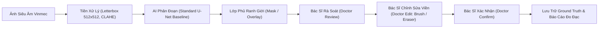

<div align="center">

# HỆ THỐNG HỖ TRỢ PHÂN ĐOẠN TỔN THƯƠNG TRÊN ẢNH SIÊU ÂM BUỒNG TRỨNG
### ỨNG DỤNG DEEP LEARNING THEO MÔ HÌNH HUMAN-IN-THE-LOOP
**KHÓA LUẬN TỐT NGHIỆP — CHUYÊN NGÀNH HỆ THỐNG THÔNG TIN QUẢN LÝ (MIS 65A)**  
*Trường Đại học Kinh tế Quốc dân (NEU) • Trường Công nghệ và Kinh tế số • Khoa Hệ thống Thông tin Quản lý*

---

[](https://www.python.org/)
[](https://pytorch.org/)
[](https://fastapi.tiangolo.com/)
[](https://developer.nvidia.com/cuda-toolkit)
[](https://docs.pytest.org/)
[](dataset/vinmec_ovarian/vinmec_dataset_manifest.json)
[](#-định-vị-sản-phẩm-phần-mềm--tuyên-bố-miễn-trừ)

</div>

---

## 📌 THÔNG TIN ĐỀ TÀI & TÁC GIẢ

* **Sinh viên thực hiện**: **Nguyễn Hữu Dũng**
* **Mã sinh viên**: `11235559` — **Lớp**: Hệ thống Thông tin Quản lý 65A (HTTTQL 65A)
* **Giảng viên hướng dẫn**: **ThS. Trần Thanh Hải**
* **Định hướng chuyên môn**: IT Business Analyst / Product Owner (ITBA / PO)
* **Cơ sở đào tạo**: Khoa Hệ thống Thông tin Quản lý — Trường Công nghệ và Kinh tế số — Đại học Kinh tế Quốc dân
* **Bối cảnh nghiên cứu nghiệp vụ**: Bệnh viện Đa khoa Quốc tế Vinmec Times City
* **Bản chất sản phẩm phần mềm**: **Bản mẫu nghiên cứu thực nghiệm (Academic Research Prototype)** phục vụ kiểm chứng khoa học, không phải hệ thống thương mại chính thức triển khai tại bệnh viện.

---

## 🎯 GIỚI THIỆU & MỤC TIÊU NGHIÊN CỨU

Trong quy trình chẩn đoán hình ảnh phụ khoa, siêu âm buồng trứng là kỹ thuật phổ biến nhất nhưng gặp phải 3 rào cản lâm sàng lớn:
1. **Đặc điểm hình ảnh phức tạp**: Độ tương phản mô mềm thấp, nhiễu đốm âm học (*speckle noise*) dày đặc, ranh giới giữa tổn thương và mô đệm buồng trứng thường mờ nhạt hoặc bị bóng cản âm (*acoustic shadowing*) che khuất.
2. **Thời gian thao tác & tính biến thiên**: Việc bác sĩ phải khoanh vùng thủ công từng ca làm tăng thời gian đọc ảnh và tiềm ẩn sự biến thiên theo kinh nghiệm chủ quan.
3. **Nhu cầu trực quan hóa minh bạch**: Bác sĩ cần mặt nạ phân đoạn dạng lớp phủ (*Mask/Overlay*) trực quan để kiểm soát và tinh chỉnh, thay vì chấp nhận một nhãn phân loại dạng hộp đen (*black-box*).

### Phát biểu bài toán cốt lõi:
Xây dựng bản mẫu web (*Human-in-the-Loop Web Prototype*) hỗ trợ phân đoạn tổn thương nhị phân (*Binary Lesion Segmentation*) trên ảnh siêu âm buồng trứng 2D B-mode, hiển thị đồng thời ảnh gốc và lớp phủ ranh giới u nang, kết hợp bộ công cụ tương tác Người – Máy (**Human-in-the-Loop**) cho phép bác sĩ rà soát, tinh chỉnh (cọ vẽ/tẩy xóa/opacity) và xác nhận kết quả thử nghiệm trong thời gian thực ($<500\text{ ms}$). 

> **Nguyên tắc cốt lõi:** Hệ thống đóng vai trò công cụ trợ lý phân đoạn và đo đạc kích thước khách quan, **tuyệt đối không thay thế vai trò chẩn đoán y khoa của bác sĩ**.

---

## 🔄 QUY TRÌNH HUMAN-IN-THE-LOOP (HITL CLINICAL WORKFLOW)



Quy trình 5 bước HITL bảo đảm bác sĩ luôn nắm quyền kiểm soát tuyệt đối:
1. **AI Segmentation**: Mô hình Standard U-Net dự đoán đường viền tổn thương ban đầu.
2. **Doctor Review**: Bác sĩ quan sát trực quan lớp phủ bán trong suốt (Overlay) đè lên ảnh gốc.
3. **Doctor Edit**: Bác sĩ sử dụng công cụ tương tác Canvas (Cọ vẽ Brush, Tẩy Eraser, Thanh trượt Opacity, Thước đo Caliper) để hiệu chỉnh đường viền ranh giới u.
4. **Final Mask**: Hệ thống cập nhật lại đường viền chính xác theo thao tác hiệu chỉnh của chuyên gia.
5. **Doctor Confirmation**: Bác sĩ ký nhận kết quả, hệ thống niêm phong Ground Truth và tự động cập nhật thống kê hiệu năng.

---

## 📊 DỮ LIỆU NGHIÊN CỨU VINMEC TIMES CITY (SEALED DATASET METRICS)

Dữ liệu nghiên cứu gồm **1.387 ảnh siêu âm thực tế tiếp nhận từ Bệnh viện ĐKQT Vinmec Times City**, tuân thủ nghiêm ngặt chuẩn phân chia cấp độ Bệnh nhân (*Patient-level Split*), cam kết **0.0% rò rỉ dữ liệu (Zero Data Leakage)**:

| Chỉ số Dữ liệu | Số lượng (Số ca/ảnh) | Tỷ lệ (%) | Ý nghĩa Lâm sàng & Khoa học |
| :--- | :---: | :---: | :--- |
| **Tổng số ảnh thu thập** | **1.387 ảnh** | **100.0%** | Tổng kho dữ liệu ảnh siêu âm buồng trứng tiếp nhận |
| **Ảnh đã tạo annotation/mask sơ bộ** | **417 ảnh** | **30.1%** | Tập ảnh có khoanh vùng ranh giới tổn thương ban đầu |
| **Tập Ground Truth xác thực chuyên môn** | **307 ảnh** | **22.1%** | Do bác sĩ chuyên khoa siêu âm trực tiếp rà soát và phê duyệt |
| **Số lượng bệnh nhân trong Ground Truth** | **185 bệnh nhân** | — | Định danh ẩn danh 100% (Anonymized PID) |
| **Số ca buồng trứng bình thường (Empty Mask)** | **35 ảnh** | **11.4% GT** | Ca bệnh sinh lý bình thường, rèn luyện mô hình chống dương tính giả |
| **Ảnh đang chờ phê duyệt (Pending Review)** | **110 ảnh** | **7.9%** | Lưu trữ riêng biệt, không đưa vào tập Ground Truth |
| **Ảnh thô chưa gán nhãn** | **970 ảnh** | **69.9%** | Lưu trữ phục vụ mở rộng nghiên cứu bán giám sát (Semi-supervised) |

### Phân vùng Dữ liệu Protocol 1 (Patient-Level Split):
* **Tập Huấn luyện (Train):** 700 ảnh.
* **Tập Thẩm định (Val):** 120 ảnh.
* **Tập Kiểm thử Độc lập (Held-out Test):** 382 ảnh.
* **Tập Ngoại kiểm Đa phương thức (CEUS Test):** 170 ảnh.
* Toàn bộ manifest được niêm phong tại: [`dataset/vinmec_ovarian/vinmec_dataset_manifest.json`](dataset/vinmec_ovarian/vinmec_dataset_manifest.json).

---

## 🚀 KẾT QUẢ THỰC NGHIỆM ĐỐI CHUẨN

### 1. Mô hình Cơ sở (Baseline): Standard U-Net
* **Kiến trúc:** 4 tầng Encoder (32 $\rightarrow$ 256), Bottleneck (512), 4 tầng Decoder với kết nối tắt trực tiếp (**7.762.465 tham số**).
* **Trọng số chính thức:** [`checkpoints/baseline_unet_best.pth`](checkpoints/baseline_unet_best.pth).
* **Kết quả trên 382 ca Test độc lập:**
  * **Mean Dice (DSC):** **0.7214 ± 0.2612** (Đạt $0.91 - 0.97$ trên các ca nang đơn thùy điển hình).
  * **Mean IoU (Jaccard):** **0.6189 ± 0.2745**.
  * **Recall / Sensitivity:** **0.7850** (Bắt trúng vùng tổn thương cao).
  * **Độ trễ suy luận:** $<35\text{ ms}$ (GPU RTX 3050) / $\approx 215\text{ ms}$ (CPU).

### 2. Mô hình So sánh Thực nghiệm: Attention U-Net
* **Kiến trúc:** Bổ sung 4 cổng Attention Gates tại các kết nối tắt để ức chế nhiễu nền và tăng trọng số viền.
* **Trọng số thực nghiệm:** [`checkpoints/best_attention_unet.pth`](checkpoints/best_attention_unet.pth).
* **Định vị:** Dùng làm đối chuẩn thực nghiệm so sánh với Baseline Standard U-Net, không tự động giả định vượt trội trong mọi trường hợp lâm sàng.

---

## 🖼️ MINH CHỨNG TRỰC QUAN HÓA (VISUAL EVIDENCE)

| Danh mục Minh chứng | Đường dẫn Tệp Tin | Ý nghĩa Kiểm định Y khoa |
| :--- | :--- | :--- |
| **Kiểm định Tiền xử lý** | [`evaluation/preprocessing_audit/preprocessing_verification_grid.png`](evaluation/preprocessing_audit/preprocessing_verification_grid.png) | Lưới 8 cặp ảnh kiểm tra Letterbox 512×512, bảo toàn 100% tỷ lệ hình học $w/h$ và không sinh pixel xám ở ranh giới. |
| **Đồ thị Động thái Hội tụ** | [`evaluation/baseline_visualizations/training_convergence_curves.png`](evaluation/baseline_visualizations/training_convergence_curves.png) | Đường cong suy giảm hàm mất mát Combo Loss và tốc độ tăng trưởng của Dice/Recall qua các epochs. |
| **Nhóm Ca Xuất sắc** | [`evaluation/baseline_visualizations/best_matches.png`](evaluation/baseline_visualizations/best_matches.png) | Các ca nang đơn thùy dịch trong, bờ nét rõ ràng ($\text{Dice} = 0.91 - 0.97$). |
| **Nhóm Ca Trung bình** | [`evaluation/baseline_visualizations/average_matches.png`](evaluation/baseline_visualizations/average_matches.png) | Các ca nang đa thùy có vách ngăn mỏng bên trong ($\text{Dice} \approx 0.72$). |
| **Nhóm Ca Thách thức** | [`evaluation/baseline_visualizations/worst_matches.png`](evaluation/baseline_visualizations/worst_matches.png) | Nang xuất huyết hồi âm kính mờ & u bì có bóng cản âm ($\text{Dice} < 0.50$) — **Luận cứ khoa học chứng minh sự cần thiết của tương tác Human-in-the-Loop**. |

---

## 🧪 ĐẢM BẢO CHẤT LƯỢNG MLOPS (87/87 TESTS PASSED)

Dự án triển khai bộ kiểm thử tự động toàn diện qua `pytest`, kiểm toán nghiêm ngặt từ khâu dữ liệu, chống rò rỉ bệnh nhân đến suy luận thời gian thực:
* **Bộ kiểm toán Cột mốc 1 (16 Tiêu chí)**: [`tests/test_milestone_1_audit.py`](tests/test_milestone_1_audit.py) (**16/16 tests passed 100%**).
* **Kiểm toán Rò rỉ Dữ liệu Bệnh nhân**: [`tests/test_dataset_splits_leakage.py`](tests/test_dataset_splits_leakage.py) (**100% zero leakage**).
* **Độ toàn vẹn Đường ống AI**: [`tests/test_ai_pipeline_integrity.py`](tests/test_ai_pipeline_integrity.py).
* **Tổng cộng toàn bộ hệ thống**: **87/87 passed (100%)**.

---

## 📁 CẤU TRÚC THƯ MỤC DỰ ÁN (PROJECT STRUCTURE)

```text
Khoa_Luan/
├── dataset/                              # Dữ liệu ảnh siêu âm nghiên cứu
│   └── vinmec_ovarian/                   # Bộ dữ liệu siêu âm buồng trứng Vinmec Times City
│       ├── OTU_2D/                       # Ảnh 2D B-Mode và mặt nạ
│       ├── OTU_CEUS/                     # Ảnh siêu âm cản âm CEUS
│       └── vinmec_dataset_manifest.json  # Niêm phong 5 chỉ số cốt lõi đề cương
├── ai_training/                          # Pipeline huấn luyện & dữ liệu
│   ├── dataset_loader.py                 # PyTorch Dataset & Letterbox DataLoader
│   ├── metrics_clinical.py               # Đo lường lâm sàng MICCAI (Dice, IoU, Recall)
│   ├── train_baseline_unet.py            # Huấn luyện Standard U-Net với AMP fp16
│   └── splits/                           # Các tệp khóa phân vùng Patient-Level
│       ├── train.csv / val.csv / test.csv / ceus_test.csv
│       └── protocol_1_manifest_summary.json
├── backend/                              # Dịch vụ Backend FastAPI & Động cơ AI
│   ├── app/                              # API routers: inference, cases, auth, health, admin
│   ├── models/                           # unet.py (Standard U-Net Baseline), attention_unet.py
│   └── services/                         # preprocessor, inference_engine, morphology_extractor
├── checkpoints/                          # Trọng số mô hình đã kiểm định
│   ├── baseline_unet_best.pth            # Baseline Standard U-Net (31.1 MB)
│   └── best_attention_unet.pth           # Attention U-Net đối chuẩn (31.5 MB)
├── frontend/                             # Bản mẫu giao diện Web Prototype Human-in-the-Loop
│   ├── index.html                        # SPA giao diện phòng đọc ảnh siêu âm
│   ├── css/                              # Theme, layout, viewer, components, admin, report
│   └── js/                               # Bộ công cụ Canvas HITL (Brush/Eraser/Caliper/Review)
├── evaluation/                           # Báo cáo đánh giá độc lập & ảnh minh chứng
│   ├── baseline_test_metrics.json        # Chỉ số kiểm thử trên 382 ca độc lập
│   └── baseline_visualizations/          # Ảnh tổng hợp: best, average, worst matches & loss curve
├── docs/                                 # Hồ sơ học thuật, đặc tả SRS & báo cáo đề tài
│   ├── dataset/                          # Tài liệu khảo sát dữ liệu & phân tích tài nguyên
│   ├── reports/                          # Báo cáo tiến độ Mốc 1 (Word + Markdown)
│   ├── thesis_proposal/                  # Đề cương sơ bộ KLTN chính thức
│   └── ovarian-ultrasound-ai/            # Đặc tả phần mềm SRS & User Flow
├── knowledge/                            # Tri thức lâm sàng & từ điển hình thái siêu âm
│   ├── normalized/                       # Chuẩn IOTA Lexicon & ACR O-RADS US v2022
│   ├── ovarian_ultrasound_knowledge_base.md
│   └── ovarian_ultrasound_sources.csv
├── scripts/                              # Kịch bản tự động hóa MLOps
└── tests/                                # Bộ kiểm thử tự động 87 test cases (100% pass)
```

---

## ⚡ HƯỚNG DẪN CÀI ĐẶT & CHẠY THỰC NGHIỆM (QUICK START)

### 1. Khởi tạo Môi trường
```bash
# Clone repository
git clone https://github.com/dungxoan31-creator/Khoa_Luan.git
cd Khoa_Luan

# Tạo và kích hoạt môi trường ảo
python -m venv .venv
.venv\Scripts\activate       # Trên Windows PowerShell

# Cài đặt thư viện phụ thuộc
pip install -r requirements.txt
```

### 2. Chạy Toàn bộ Test Suite Kiểm toán (87 Tests)
```bash
pytest -v
```

### 3. Khởi chạy Backend FastAPI & Giao diện Web Prototype
```bash
python -m uvicorn backend.app.main:app --host 127.0.0.1 --port 8000 --reload
```
* Mở trình duyệt tại: `http://127.0.0.1:8000/` để thao tác trực tiếp trên bản mẫu Human-in-the-Loop Canvas.
* Kiểm tra API Health Check: `http://127.0.0.1:8000/api/health`

---

## ⚖️ ĐỊNH VỊ SẢN PHẨM PHẦN MỀM & TUYÊN BỐ MIỄN TRỪ

1. **Bản mẫu nghiên cứu học thuật (Research Prototype):** Sản phẩm phần mềm trong kho lưu trữ này được xây dựng độc lập phục vụ Khóa luận Tốt nghiệp chuyên ngành Hệ thống Thông tin Quản lý tại Đại học Kinh tế Quốc dân (NEU).
2. **Không phải sản phẩm thương mại của Vinmec:** Hệ thống không đại diện cho bất kỳ sản phẩm thương mại chính thức nào đang vận hành trong mạng lưới khám chữa bệnh của Tập đoàn Vingroup hay Hệ thống Y tế Vinmec.
3. **Mục đích hỗ trợ kỹ thuật:** Hệ thống đóng vai trò công cụ trợ lý phân đoạn và đo lường kích thước khách quan, mọi kết luận chẩn đoán lâm sàng bắt buộc phải do bác sĩ y khoa có chứng chỉ hành nghề trực tiếp thực hiện.
