<div align="center">

# HỆ THỐNG HỖ TRỢ PHÂN ĐOẠN TỔN THƯƠNG TRÊN ẢNH SIÊU ÂM BUỒNG TRỨNG
### ỨNG DỤNG DEEP LEARNING THEO MÔ HÌNH HUMAN-IN-THE-LOOP
**KHÓA LUẬN TỐT NGHIỆP — CHUYÊN NGÀNH HỆ THỐNG THÔNG TIN QUẢN LÝ (MIS 65A)**  
*Trường Đại học Kinh tế Quốc dân (NEU) • Trường Công nghệ • Khoa Hệ thống Thông tin Quản lý*

---

[](https://www.python.org/)
[](https://pytorch.org/)
[](https://fastapi.tiangolo.com/)
[](https://developer.nvidia.com/cuda-toolkit)
[](https://docs.pytest.org/)
[](docs/reports/Bao_Cao_Tien_Do_Moc_1_NguyenHuuDung.md)
[](#-đạo-đức-nghiên-cứu--bảo-mật-dữ-liệu)

</div>

---

## 📌 THÔNG TIN ĐỀ TÀI & TÁC GIẢ

* **Sinh viên thực hiện**: **Nguyễn Hữu Dũng**
* **Mã sinh viên**: `11235559` — **Lớp**: Hệ thống Thông tin Quản lý 65A (HTTTQL 65A)
* **Giảng viên hướng dẫn**: **ThS. Trần Thanh Hải**
* **Định hướng chuyên môn**: IT Business Analyst / Product Owner (ITBA / PO)
* **Cơ sở đào tạo**: Khoa Hệ thống Thông tin Quản lý — Trường Công nghệ — Đại học Kinh tế Quốc dân
* **Bối cảnh khảo sát**: Bệnh viện Đa khoa Quốc tế Vinmec Times City (Bản mẫu chức năng nghiên cứu học thuật)

---

## 🎯 GIỚI THIỆU & MỤC TIÊU NGHIÊN CỨU

Trong quy trình chẩn đoán hình ảnh phụ khoa, siêu âm buồng trứng là kỹ thuật phổ biến nhất nhưng gặp phải 3 rào cản lâm sàng lớn:
1. **Đặc điểm hình ảnh phức tạp**: Độ tương phản mô mềm thấp, nhiễu đốm âm học (*speckle noise*) dày đặc, ranh giới giữa tổn thương và mô đệm buồng trứng thường mờ nhạt hoặc bị bóng cản âm (*acoustic shadowing*) che khuất.
2. **Thời gian thao tác & tính biến thiên**: Việc bác sĩ phải khoanh vùng thủ công từng ca làm tăng thời gian đọc ảnh và tiềm ẩn sự biến thiên theo kinh nghiệm chủ quan.
3. **Nhu cầu trực quan hóa minh bạch**: Bác sĩ cần mặt nạ phân đoạn dạng lớp phủ (*Mask/Overlay*) trực quan để kiểm soát và tinh chỉnh, thay vì chấp nhận một nhãn phân loại dạng hộp đen (*black-box*).

### Phát biểu bài toán cốt lõi:
Xây dựng bản mẫu chức năng Web (*Web Functional Prototype*) hỗ trợ phân đoạn tổn thương nhị phân (*Binary Lesion Segmentation*) trên ảnh siêu âm buồng trứng 2D B-mode, hiển thị đồng thời ảnh gốc và lớp phủ ranh giới u nang, kết hợp bộ công cụ tương tác Người – Máy (**Human-in-the-Loop**) cho phép bác sĩ rà soát, tinh chỉnh (cọ vẽ/tẩy xóa/opacity) và xác nhận kết quả thử nghiệm trong thời gian thực ($<500\text{ ms}$). Hệ thống đóng vai trò công cụ trợ lý phân đoạn, tuyệt đối không thay thế vai trò chẩn đoán y khoa của bác sĩ.

---

## 🏗️ KIẾN TRÚC ĐƯỜNG ỐNG XỬ LÝ (END-TO-END PIPELINE)

Hệ thống được thiết kế theo kiến trúc mô-đun hóa cao, phân tách độc lập giữa tầng tiền xử lý hình ảnh y tế, động cơ mô hình học sâu, dịch vụ suy luận FastAPI và giao diện tương tác:

```mermaid
flowchart LR
    A["Raw Ultrasound (B-mode)"] --> B["ROI Cropping & Letterbox 512x512"]
    B --> C["CLAHE Contrast Enhancement"]
    C --> D["Standard U-Net Baseline (7.76M Params)"]
    D --> E["Probability Sigmoid & Threshold 0.5"]
    E --> F["Inverse Letterbox to Original Size"]
    F --> G["Interactive Dual-layer Canvas (HITL)"]
    G --> H["Morphology & Caliper D1/D2 Extraction"]
    H --> I["Export Research Summary"]
```



---

## 📊 DỮ LIỆU & ĐÓNG BĂNG PHÂN VÙNG (ZERO-LEAKAGE PROTOCOL)

Dữ liệu nghiên cứu gồm **1.387 ảnh siêu âm thực tế đã được ẩn danh hoàn toàn (100% De-identified)**, tuân thủ nghiêm ngặt chuẩn phân chia cấp độ Bệnh nhân (*Patient-level Split*), cam kết **0.0% rò rỉ dữ liệu (Zero Data Leakage)**:

| Phân vùng Dữ liệu (Split) | Số lượng Ca (Cases) | Nguồn Trích xuất | Mục đích Nghiên cứu |
| :--- | :---: | :--- | :--- |
| **Tập Huấn luyện (Train)** | **700** | OTU_2D_train | Tối ưu hóa trọng số mạng nơ-ron qua AdamW |
| **Tập Thẩm định (Validation)** | **120** | OTU_2D_train | Theo dõi hội tụ, tinh chỉnh siêu tham số & Early Stopping |
| **Tập Kiểm thử Độc lập (Held-out Test)** | **382** | OTU_2D_test (MMOTU Benchmark) | Đánh giá khách quan, đối chuẩn công bố quốc tế |
| **Tập Ngoại kiểm (CEUS Test)** | **170** | CEUS Multimodal | Đánh giá suy biến khi khác biệt phương thức siêu âm |
| **TỔNG CỘNG** | **1.372** | **100% Cặp Ảnh - Mask** | **Tỷ lệ Trùng lặp Bệnh nhân: 0.0%** |

*Toàn bộ 307 ảnh Ground Truth chính thức (từ 185 bệnh nhân, gồm 35 ca Empty Mask đại diện cho buồng trứng bình thường) và 110 ảnh pending đã được niêm phong tại `ai_training/splits/protocol_1_manifest_summary.json`.*

---

## 🚀 KẾT QUẢ THỰC NGHIỆM CỘT MỐC 1 (06/09 – 20/09/2026)

### 1. Động thái Huấn luyện Mô hình Baseline Standard U-Net (10 Epochs)
* Kiến trúc: 4 tầng Encoder (32 $\rightarrow$ 256), Bottleneck (512), 4 tầng Decoder với kết nối tắt trực tiếp (**7.762.465 tham số**).
* Phần cứng: **NVIDIA GeForce RTX 3050 Laptop GPU (4GB VRAM)**, kích hoạt **Automatic Mixed Precision (AMP fp16)**.
* Hàm mất mát: $\mathcal{L}_{\text{Combo}} = \mathcal{L}_{\text{BCE}} + \mathcal{L}_{\text{Dice}}$.

| Epoch | Thời gian | Train Loss | Val Loss | Val Foreground Dice | Val Recall (Sensitivity) | Val Specificity |
| :---: | :---: | :---: | :---: | :---: | :---: | :---: |
| 1 | 67.7s | 0.4798 | 0.4804 | 0.5541 | 0.8790 | 0.8326 |
| 5 | 66.1s | 0.2824 | 0.2641 | 0.7193 | 0.8743 | 0.9451 |
| **10** | **66.9s** | **0.2261** | **0.2206** | **0.7728** | **0.8661** | **0.9680** |

### 2. Kết quả Đánh giá Độc lập trên 382 Ca Test Held-out (Chuẩn MICCAI)
*Nguồn: `evaluation/baseline_test_metrics.json`*

| Chỉ số Đánh giá MICCAI | Giá trị Thực nghiệm (Mean ± Std) | Ý nghĩa Lâm sàng & Khoa học |
| :--- | :---: | :--- |
| **Foreground Dice Similarity (DSC)** | **0.7504 ± 0.2092** | Độ trùng khớp diện tích phân đoạn tổn thương so với Ground Truth bác sĩ |
| **Foreground IoU (Jaccard Index)** | **0.6402 ± 0.2399** | Tỷ lệ diện tích giao trên diện tích hợp của mặt nạ tổn thương |
| **Sensitivity / Recall (Độ nhạy)** | **0.8942 (89.42%)** | **Khả năng bắt trúng tổn thương rất cao**, tránh bỏ sót vùng viền u |
| **Precision (Độ chính xác)** | **0.7061 (70.61%)** | Xu hướng phân đoạn quá đà (*over-segmentation*) do viền hồi âm yếu |
| **Specificity (Độ đặc hiệu)** | **0.9557 (95.57%)** | Khả năng loại trừ chính xác mô buồng trứng bình thường (Empty Mask) |

---

## 🖼️ MINH CHỨNG TRỰC QUAN HÓA (VISUAL EVIDENCE ARTIFACTS)

| Danh mục Minh chứng | Đường dẫn Tệp Tin | Ý nghĩa Kiểm định Y khoa |
| :--- | :--- | :--- |
| **Kiểm định Tiền xử lý** | [`evaluation/preprocessing_audit/preprocessing_verification_grid.png`](evaluation/preprocessing_audit/preprocessing_verification_grid.png) | Lưới 8 cặp ảnh kiểm tra Letterbox 512×512, bảo toàn 100% tỷ lệ hình học $w/h$ và không sinh pixel xám ở ranh giới. |
| **Đồ thị Động thái Hội tụ** | [`evaluation/baseline_visualizations/training_convergence_curves.png`](evaluation/baseline_visualizations/training_convergence_curves.png) | Đường cong suy giảm hàm mất mát Combo Loss và tốc độ tăng trưởng của Dice/Recall qua 10 epochs. |
| **Nhóm Ca Xuất sắc** | [`evaluation/baseline_visualizations/best_matches.png`](evaluation/baseline_visualizations/best_matches.png) | Các ca nang đơn thùy dịch trong, bờ nét rõ ràng ($\text{Dice} = 0.91 - 0.97$). |
| **Nhóm Ca Trung bình** | [`evaluation/baseline_visualizations/average_matches.png`](evaluation/baseline_visualizations/average_matches.png) | Các ca nang đa thùy có vách ngăn mỏng bên trong ($\text{Dice} \approx 0.72$). |
| **Nhóm Ca Thách thức** | [`evaluation/baseline_visualizations/worst_matches.png`](evaluation/baseline_visualizations/worst_matches.png) | Nang xuất huyết hồi âm kính mờ & u bì có bóng cản âm ($\text{Dice} < 0.50$) — **Luận cứ khoa học chứng minh sự cần thiết của Attention Gate và tương tác Human-in-the-Loop**. |

---

## 🧪 ĐẢM BẢO CHẤT LƯỢNG & KIỂM TOÁN MLOPS (87/87 TESTS PASSED)

Dự án triển khai bộ kiểm thử tự động toàn diện qua `pytest`, kiểm toán nghiêm ngặt từ khâu dữ liệu, nạp batch đến suy luận thời gian thực:
* **Bộ kiểm toán Cột mốc 1 (16 Tiêu chí)**: [`tests/test_milestone_1_audit.py`](tests/test_milestone_1_audit.py) (**16/16 tests passed 100%**).
  * *Dataset discovery, Image-mask matching, Patient split zero-leakage, Preprocessing shape consistency, Binary mask integrity, Post-preprocessing pair validation, DataLoader batch tensor (4, 1, 512, 512), U-Net forward pass, Combo loss computation & backward gradient, 1-step training smoke test, Sigmoid thresholding, Inverse letterbox restoration, Clinical Dice / IoU / Recall validation, End-to-end pipeline flow.*
* **Tổng cộng toàn bộ hệ thống**: **87/87 passed (100%)**.

---

## ⚡ HƯỚNG DẪN CÀI ĐẶT & CHẠY THỰC NGHIỆM (QUICK START)

### 1. Khởi tạo Môi trường
```bash
# Clone repository
git clone https://github.com/dungxoan31-creator/Khoa_Luan.git
cd Khoa_Luan

# Tạo và kích hoạt môi trường ảo
python -m venv .venv
.venv\Scripts\activate       # Trên Windows PowerShell / Command Prompt

# Cài đặt các thư viện phụ thuộc
pip install torch torchvision --index-url https://download.pytorch.org/whl/cu124
pip install -r requirements.txt
```

### 2. Chạy Toàn bộ Test Suite Kiểm toán
```bash
pytest -v tests/test_milestone_1_audit.py    # Chạy riêng 16 bài kiểm toán Mốc 1
pytest -q                                   # Chạy toàn bộ 87 tests dự án
```

### 3. Đánh giá Mô hình Baseline trên Tập Test Độc lập
```bash
python evaluation/evaluate_baseline_testset.py
```

### 4. Khởi chạy Backend FastAPI Prototype
```bash
python -m uvicorn backend.app.main:app --host 127.0.0.1 --port 8000 --reload
```
*Kiểm tra trạng thái hệ thống qua trình duyệt tại:* `http://127.0.0.1:8000/api/health`

---

## 📁 CẤU TRÚC THƯ MỤC DỰ ÁN (PROJECT STRUCTURE)

```
Khoa_Luan/
├── ai_training/                          # Pipeline huấn luyện & dữ liệu
│   ├── dataset_loader.py                 # PyTorch Dataset & DataLoader chuẩn hóa
│   ├── metrics_clinical.py               # Đo lường lâm sàng MICCAI (Foreground Dice, IoU, Recall)
│   ├── train_baseline_unet.py            # Huấn luyện Standard U-Net với AMP fp16
│   ├── splits/                           # Các tệp khóa phân vùng Protocol 1 Zero-Leakage
│   │   ├── train.csv (700) / val.csv (120) / test.csv (382) / ceus_test.csv (170)
│   │   └── protocol_1_manifest_summary.json
│   └── production_model/
│       └── baseline_training_log.json    # Log hội tụ 10 epochs
├── backend/                              # Dịch vụ Backend FastAPI & Động cơ AI
│   ├── app/
│   │   ├── main.py                       # Điểm khởi chạy ứng dụng FastAPI
│   │   └── routers/                      # Các endpoints: inference, cases, auth, health
│   ├── models/
│   │   ├── unet.py                       # Standard U-Net (7.76M params - Baseline Mốc 1)
│   │   ├── attention_unet.py             # Attention U-Net (7.85M params - Đối chuẩn Mốc 2)
│   │   └── losses.py                     # Hàm mất mát Combo Loss (BCE + Dice)
│   └── services/
│       ├── preprocessor.py               # Letterbox 512×512, Nearest interpolation, CLAHE
│       ├── inference_engine.py           # Bộ suy luận thời gian thực (<100ms)
│       └── morphology_extractor.py       # Trích xuất kích thước Caliper D1/D2 tự động
├── checkpoints/                          # Trọng số mô hình đã huấn luyện
│   └── baseline_unet_best.pth            # Trọng số tối ưu của mô hình Baseline
├── docs/                                 # Hồ sơ học thuật & Báo cáo tiến độ
│   └── reports/
│       ├── Bao_Cao_Tien_Do_Moc_1_NguyenHuuDung.docx  # Báo cáo Word chuẩn nộp CBHD (nhúng 5 hình ảnh & 6 bảng)
│       └── Bao_Cao_Tien_Do_Moc_1_NguyenHuuDung.md    # Bản sao Markdown đồng bộ
├── evaluation/                           # Minh chứng đánh giá & trực quan hóa
│   ├── baseline_test_metrics.json        # Kết quả 382 ca kiểm thử độc lập
│   ├── baseline_visualizations/          # Ảnh trực quan: best, average, worst matches & loss curve
│   └── preprocessing_audit/              # Lưới đối soát kiểm định tiền xử lý ảnh-mask
├── scripts/                              # Kịch bản tự động hóa MLOps
│   ├── align_milestone_1_report.py       # Tự động xuất bản báo cáo Word & Markdown chuẩn học thuật
│   └── audit_preprocessing_pairs.py      # Đối soát kiểm định trực quan 8 cặp mẫu
└── tests/                                # Test suite tự động (87/87 tests passed)
    ├── test_milestone_1_audit.py         # 16 bài kiểm toán kỹ thuật Mốc 1
    └── test_end_to_end_pipeline.py       # Kiểm thử tích hợp toàn diện quy trình
```

---

## 🗺️ LỘ TRÌNH THỰC HIỆN CÁC CỘT MỐC (ROADMAP)

* [x] **Cột mốc 1 (06/09 – 20/09/2026)**: Đóng băng dữ liệu theo Patient ID, hoàn thiện pipeline tiền xử lý Letterbox 512×512, huấn luyện Baseline Standard U-Net, benchmark trên 382 ca kiểm thử độc lập, hoàn thành báo cáo tiến độ và kiểm toán MLOps 16/16 tests.
* [ ] **Cột mốc 2 (21/09 – 05/10/2026)**: Huấn luyện mô hình Attention U-Net (7.85M params), lập bảng Ablation Study đối chuẩn công bằng với Baseline U-Net, đóng gói FastAPI inference service, xây dựng bản mẫu giao diện Web Canvas tương tác Human-in-the-Loop (Dual-layer Canvas: Brush, Eraser, Opacity, Caliper), soạn thảo bản thảo Chương 3 KLTN.
* [ ] **Cột mốc 3 (06/10 – 20/10/2026)**: Tích hợp hoàn chỉnh Frontend-Backend, kết nối mô hình suy luận thời gian thực, hoàn thiện tài liệu đặc tả SRS chi tiết (Use Cases, User Stories, Gherkin Acceptance Criteria).
* [ ] **Cột mốc 4 (21/10 – 05/11/2026)**: Thử nghiệm bán tự động với người dùng chuyên môn, thu thập thời gian thao tác, mức độ chỉnh sửa mask và khảo sát chỉ số khả dụng hệ thống theo thang đo SUS (mục tiêu $\text{SUS} \ge 75/100$).
* [ ] **Cột mốc 5 (06/11 – 20/11/2026)**: Hoàn thiện toàn văn Khóa luận Tốt nghiệp (5 chương), hoàn thiện Slide báo cáo và bảo vệ thử trước Giảng viên hướng dẫn.

---

## ⚖️ ĐẠO ĐỨC NGHIÊN CỨU & BẢO MẬT DỮ LIỆU

1. **Tuân thủ Đạo đức Y tế**: Dữ liệu siêu âm được sử dụng phục vụ mục đích nghiên cứu học thuật độc lập, đã được ẩn danh hóa 100% (xóa bỏ hoàn toàn họ tên, tuổi, số bệnh án, ngày thăm khám và thông tin cơ sở y tế).
2. **Giới hạn Trách nhiệm Hệ thống**: Hệ thống phần mềm được phát triển đóng vai trò công cụ trợ giúp phân đoạn và đo đạc hình học thử nghiệm; **hoàn toàn không đưa ra kết luận bệnh học tự động và không thay thế phán đoán chuyên môn của bác sĩ sản phụ khoa**.

---

<div align="center">
  <b>Nguyễn Hữu Dũng — Khóa luận Tốt nghiệp MIS 65A (NEU)</b><br>
  <i>Cán bộ hướng dẫn khoa học: ThS. Trần Thanh Hải</i>
</div>
