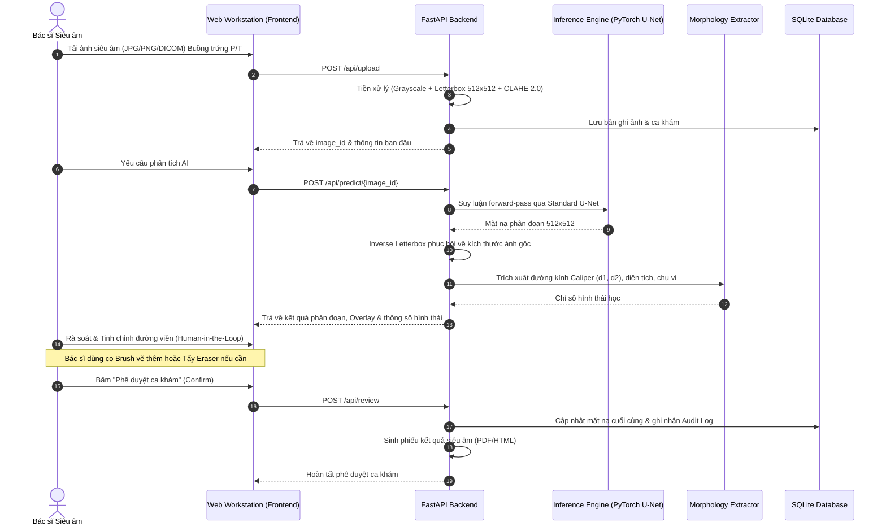

# Hệ thống Hỗ trợ Chẩn đoán & Phân đoạn Siêu âm Buồng trứng Human-in-the-Loop (CDSS)
> **Ovarian Ultrasound AI Decision Support System**  
> Dự án Khóa luận Tốt nghiệp Hệ thống Thông tin Quản lý (MIS / ITBA / AI) – Trường Đại học Kinh tế Quốc dân (NEU).  
> Dữ liệu nghiên cứu thực nghiệm: Bệnh viện Đa khoa Quốc tế Vinmec Times City.

---

## 1. Giới thiệu Tổng quan & Bài toán Giải quyết

### 1.1. Bối cảnh & Thách thức Y tế
Chẩn đoán hình ảnh siêu âm buồng trứng (phát hiện nang, u nang, khối u đặc/hỗn hợp) là kỹ thuật phổ biến nhưng phụ thuộc lớn vào kinh nghiệm chủ quan của bác sĩ chuyên khoa. Các tổn thương buồng trứng thường có ranh giới phức tạp, độ tương phản mô mềm thấp, nhiễu âm (speckle noise) và biến dạng giải phẫu lớn giữa các bệnh nhân.

### 1.2. Giải pháp của Dự án
Dự án xây dựng một hệ thống phần mềm hỗ trợ ra quyết định lâm sàng (**Clinical Decision Support System - CDSS**) hoàn chỉnh, kết hợp giữa mô hình học sâu phân đoạn ảnh y tế và giao diện máy trạm lâm sàng (Clinical Workstation):
- **Phân đoạn tự động bằng Deep Learning (U-Net)**: Xác định đường viền và diện tích nghi ngờ tổn thương trên ảnh siêu âm 2D B-mode.
- **Trích xuất thông số hình thái tự động (Morphometry)**: Đo lường đường kính tổn thương (Caliper $d_1, d_2$), chu vi, diện tích và thể tích phỏng định theo khuyến cáo ISUOG.
- **Cơ chế Human-in-the-Loop (HITL)**: Thay vì áp dụng AI "hộp đen" hoàn toàn tự động, hệ thống thiết kế quy trình bác sĩ kiểm soát tuyệt đối. Bác sĩ trực tiếp rà soát kết quả phân đoạn của AI, sử dụng công cụ tương tác (Brush / Eraser) để tinh chỉnh đường viền nếu cần trước khi phê duyệt và xuất phiếu kết quả.

> [!IMPORTANT]
> **Tuyên bố Phạm vi Lâm sàng (Clinical Disclaimer)**: Hệ thống là bản mẫu nghiên cứu thực nghiệm (Research Prototype). Kết quả phân đoạn đường viền và đo đạc hình thái đóng vai trò hỗ trợ tham khảo; hệ thống không đưa ra kết luận chẩn đoán bệnh học tự động và không thay thế quyết định chuyên môn của bác sĩ.

---

## 2. Các Chức năng Chính của Hệ thống

1. **Quản lý Ca khám & Ảnh siêu âm (Case Management)**:
   - Tiếp nhận thông tin bệnh nhân, mã hồ sơ (PID) và quản lý ảnh siêu âm độc lập cho hai bên buồng trứng (Phải - Right / Trái - Left).
   - Hỗ trợ định dạng ảnh đồ họa tiêu chuẩn (JPG, PNG) và định dạng chuẩn y tế DICOM (`.dcm`), tự động trích xuất thông số tỷ lệ vật lý (Pixel Spacing).
2. **Kiểm định Chất lượng Ảnh (Image Quality Assessment - IQA)**:
   - Xác thực tỷ lệ khung hình, độ tương phản và kiểm tra tính hợp lệ của ảnh siêu âm trước khi đưa vào mô hình học sâu.
3. **Phân đoạn Tổn thương Tự động (Automated U-Net Inference)**:
   - Tiền xử lý chuẩn y tế: Cân bằng biểu đồ độ sáng cục bộ CLAHE, Letterbox giữ nguyên tỷ lệ khung hình $512 \times 512$.
   - Suy luận mạng nơ-ron: Standard U-Net / U-Net++ ResNet34 tạo mặt nạ phân đoạn nhị phân (Binary Mask) và lớp phủ trực quan (Color Overlay).
4. **Máy trạm Rà soát Tương tác Human-in-the-Loop (Interactive Workstation)**:
   - Canvas đa lớp thời gian thực: Hiển thị song song ảnh gốc, lớp phủ AI và công cụ vẽ tay.
   - Bộ công cụ chỉnh sửa lâm sàng: Bút vẽ viền (Brush), Tẩy (Eraser), điều chỉnh kích thước nét, tùy chỉnh độ mờ (Opacity slider), Hoàn tác / Làm lại (Undo/Redo).
5. **Đo đạc Hình thái Tổn thương (Morphology Extraction)**:
   - Tự động trích xuất bao lồi, chu vi và đo 2 trục đường kính vuông góc lớn nhất ($d_1, d_2$). Quy đổi ra milimet (mm) chính xác nếu ảnh có gắn nhãn DICOM spacing.
6. **Xuất Phiếu Kết quả Siêu âm (Medical Report Generation)**:
   - Tự động tổng hợp hình ảnh siêu âm, kích thước tổn thương và nhận xét của bác sĩ vào phiếu kết quả siêu âm chuyên nghiệp sẵn sàng in ấn/lưu trữ.
7. **Kiểm toán Hệ thống & Quản trị (Admin & Audit Trails)**:
   - Nhật ký kiểm toán (Audit Logs) lưu vết chi tiết từng thao tác tải ảnh, thời gian suy luận AI, chỉnh sửa của bác sĩ và phê duyệt ca khám.

---

## 3. Kiến trúc Hệ thống (System Architecture)

Hệ thống được thiết kế theo kiến trúc phân tầng dạng Client - Server với tính mô-đun hóa cao:

```
┌────────────────────────────────────────────────────────────────────────┐
│                      CLINICAL FRONTEND WORKSTATION                     │
│  (HTML5 / CSS3 Dark Mode / Canvas Multilayer / Vanilla JavaScript ES6) │
│  - Case Navigator      - Multi-layer Canvas       - Brush / Eraser     │
│  - Measurement Overlay - HITL Doctor Review Panel - Medical Report UI  │
└───────────────────────────────────┬────────────────────────────────────┘
                                    │ HTTP / RESTful API (JSON & Multipart)
┌───────────────────────────────────▼────────────────────────────────────┐
│                       BACKEND API SERVICE (FastAPI)                    │
│  - Routers: /cases, /inference, /reviews, /admin, /evaluation          │
│  - Core Services: Preprocessor (Letterbox/CLAHE), MorphologyExtractor  │
│  - Security & Storage: Input validation, Audit trails, SQLite Database │
└───────────────────────────────────┬────────────────────────────────────┘
                                    │ PyTorch Tensor Pipeline
┌───────────────────────────────────▼────────────────────────────────────┐
│                    MODEL CORE & CLINICAL REASONING                     │
│  - Model Registry: Checkpoint SHA-256 Verification                     │
│  - Architectures: Standard U-Net (Baseline), U-Net++ (ResNet34)        │
│  - Inference Engine: Automatic CPU / CUDA Device Selection             │
│  - Morphometry Engine: Caliper (d1, d2), Area, Perimeter Calculation   │
└────────────────────────────────────────────────────────────────────────┘
```

---

## 4. Công nghệ Sử dụng (Tech Stack)

| Thành phần | Công nghệ / Thư viện | Phiên bản | Vai trò & Mục đích sử dụng |
|---|---|---|---|
| **Ngôn ngữ lõi** | Python | 3.12+ | Môi trường thực thi toàn bộ Backend và Pipeline AI |
| **API Framework** | FastAPI, Starlette, Uvicorn | 0.141+ | Cung cấp dịch vụ RESTful API tốc độ cao, xử lý đa tiến trình |
| **Học sâu (Deep Learning)**| PyTorch, Torchvision | 2.6.0+ | Huấn luyện mô hình và thực thi suy luận mạng U-Net / U-Net++ |
| **Kiến trúc mở rộng** | segmentation-models-pytorch | 0.5.0+ | Hỗ trợ cấu hình mạng phân đoạn U-Net++ với pretrained backbone |
| **Xử lý ảnh Y tế** | OpenCV (`cv2`), Pillow, Albumentations | 5.0+ | Đọc ảnh, tiền xử lý Letterbox, thuật toán CLAHE, tăng cường dữ liệu |
| **Chuẩn ảnh DICOM** | pydicom | 3.0+ | Giải mã ảnh định dạng DICOM và trích xuất thẻ siêu âm (Pixel Spacing) |
| **Cơ sở dữ liệu** | SQLite, SQLAlchemy, Pydantic v2 | 2.1+ | Lưu trữ thông tin ca bệnh, lịch sử đánh giá và kiểm thực dữ liệu vào/ra |
| **Giao diện Người dùng**| HTML5, CSS3, JavaScript (Canvas API) | Native ES6 | Workstation mượt mà, không phụ thuộc nặng framework client |
| **Kiểm thử & Chất lượng**| Pytest, Playwright, Ruff | 9.1+ | Kiểm thử tự động (Unit / Integration / E2E Browser) và linting |
| **Triển khai Container**| Docker, Docker Compose, Nginx | - | Đóng gói môi trường và cấu hình Reverse Proxy phục vụ vận hành |

---

## 5. Cấu trúc Thư mục Dự án

```text
UNet-Vinmec-KhoaLuan/
├── backend/                 # Máy chủ dịch vụ FastAPI Backend
│   ├── app/                 # Điểm khởi chạy API (main.py), định tuyến routers/, cấu hình (config.py)
│   ├── core/                # Xử lý hình ảnh cấp thấp (image_utils.py)
│   ├── db/                  # Khởi tạo cơ sở dữ liệu SQLAlchemy (database.py)
│   ├── models/              # Kiến trúc mạng nơ-ron (unet.py, attention_unet.py, losses.py)
│   ├── schemas/             # Pydantic Schemas kiểm thực dữ liệu đầu vào/ra
│   └── services/            # Dịch vụ nghiệp vụ: InferenceEngine, Preprocessor, MorphologyExtractor
├── frontend/                # Giao diện Web Workstation dành cho bác sĩ
│   ├── css/                 # Giao diện Dark Mode tối ưu cho phòng chẩn đoán hình ảnh
│   ├── js/modules/          # Module xử lý Canvas, API, tương tác HITL, vẽ đo đạc
│   └── index.html           # Trang giao diện chính của hệ thống
├── ai_training/             # Pipeline huấn luyện mô hình PyTorch
│   ├── dataset_loader.py    # Dataloader ảnh siêu âm kèm Letterbox & CLAHE
│   ├── metrics_clinical.py  # Bộ đo lường phân đoạn lâm sàng (Dice, IoU, Recall, Specificity)
│   ├── splits/              # Cấu hình phân chia tập dữ liệu huấn luyện, thẩm định và kiểm thử
│   └── train_baseline_unet.py # Huấn luyện mô hình U-Net cơ sở
├── dataset/                 # Thư mục dữ liệu ảnh gốc (Chỉ đọc - Read Only)
│   ├── 2d/                  # Ảnh siêu âm 2D B-mode (images/ và masks/)
│   ├── 3d/                  # Ảnh siêu âm 3D bổ trợ (images/ và masks/)
│   └── index.csv            # Chỉ mục toàn bộ mẫu ảnh và nguồn gốc dữ liệu
├── metadata/                # Metadata dữ liệu chuẩn hóa (Ground Truth 307 ca)
│   ├── kltn_ground_truth_307.csv # Tập Ground Truth 307 ca được chuyên gia xác thực
│   ├── train.csv, val.csv, test.csv # Phân chia tập mẫu chuẩn
│   └── thesis_exports/      # File CSV tiếng Việt phục vụ phụ lục khóa luận
├── checkpoints/             # Trọng số mô hình đã huấn luyện (.pth)
│   ├── unified_vinmec_refine_2026-10-06/ # Trọng số Standard U-Net chính thức (Production)
│   └── unetplusplus_resnet34_2026-10-06/ # Checkpoint mô hình U-Net++
├── evaluation/              # Bằng chứng đánh giá thực nghiệm lâm sàng & manifest mô hình
│   ├── selected_model.json  # Manifest chỉ định mô hình phục vụ với mã băm SHA-256
│   └── archive/             # Kho lưu trữ kết quả thực nghiệm các mốc trước
├── scripts/                 # Bộ công cụ xử lý dữ liệu, kiểm toán và xuất báo cáo
├── templates/               # Mẫu HTML phiếu kết quả siêu âm
├── tests/                   # Bộ kiểm thử tự động (Pytest & Playwright)
├── data/                    # Thư mục runtime cục bộ (uploads tạm và reports sinh ra)
├── PROJECT_STRUCTURE.md     # Danh mục vai trò chi tiết của 100% tệp tin trong repo
├── MODEL_CARD.md            # Báo cáo kỹ thuật mô hình (Model Card)
├── TECH_STACK.md            # Thông số chi tiết các phiên bản thư viện
├── pyproject.toml           # Cấu hình Pytest và Ruff
├── Dockerfile               # File build container Docker
└── docker-compose.yml       # Cấu hình khởi chạy hệ thống cùng Nginx
```

---

## 6. Luồng Hoạt động Cốt lõi (Workflow)


```mermaid
sequenceDiagram
    autonumber
    actor BacSi as Bác sĩ Siêu âm
    participant UI as Web Workstation (Frontend)
    participant API as FastAPI Backend
    participant DL as Inference Engine (PyTorch U-Net)
    participant Morph as Morphology Extractor
    participant DB as SQLite Database

    BacSi->>UI: Tải ảnh siêu âm (JPG/PNG/DICOM) Buồng trứng P/T
    UI->>API: POST /api/upload
    API->>API: Tiền xử lý (Grayscale + Letterbox 512x512 + CLAHE 2.0)
    API->>DB: Lưu bản ghi ảnh & ca khám
    API-->>UI: Trả về image_id & thông tin ban đầu

    BacSi->>UI: Yêu cầu phân tích AI
    UI->>API: POST /api/predict/{image_id}
    API->>DL: Suy luận forward-pass qua Standard U-Net
    DL-->>API: Mặt nạ phân đoạn 512x512
    API->>API: Inverse Letterbox phục hồi về kích thước ảnh gốc
    API->>Morph: Trích xuất đường kính Caliper (d1, d2), diện tích, chu vi
    Morph-->>API: Chỉ số hình thái học
    API-->>UI: Trả về kết quả phân đoạn, Overlay & thông số hình thái

    BacSi->>UI: Rà soát & Tinh chỉnh đường viền (Human-in-the-Loop)
    Note over BacSi,UI: Bác sĩ dùng cọ Brush vẽ thêm hoặc Tẩy Eraser nếu cần
    BacSi->>UI: Bấm "Phê duyệt ca khám" (Confirm)
    UI->>API: POST /api/review
    API->>DB: Cập nhật mặt nạ cuối cùng & ghi nhận Audit Log
    API->>API: Sinh phiếu kết quả siêu âm (PDF/HTML)
    API-->>UI: Hoàn tất phê duyệt ca khám
```

---

## 7. Yêu cầu Môi trường & Hướng dẫn Cài đặt

### 7.1. Yêu cầu Hệ thống
- **Hệ điều hành**: Windows 10/11, Ubuntu 20.04+, hoặc macOS.
- **Python**: Phiên bản `>= 3.10` (khuyến nghị `Python 3.12`).
- **Phần cứng đề xuất**: RAM tối thiểu 8 GB; có GPU NVIDIA (VRAM $\ge 4\text{ GB}$) nếu muốn huấn luyện hoặc tối ưu độ trễ suy luận (hệ thống tự động chạy trên CPU nếu không có CUDA).

### 7.2. Cài đặt Môi trường Cục bộ

1. **Clone repository về máy**:
   ```bash
   git clone https://github.com/dungxoan31-creator/UNet-Vinmec-KhoaLuan.git
   cd UNet-Vinmec-KhoaLuan
   ```

2. **Khởi tạo và kích hoạt môi trường ảo (Virtual Environment)**:
   - **Trên Windows PowerShell**:
     ```powershell
     python -m venv .venv
     .\.venv\Scripts\Activate.ps1
     ```
   - **Trên Linux / macOS**:
     ```bash
     python3 -m venv .venv
     source .venv/bin/activate
     ```

3. **Cài đặt các gói thư viện phụ thuộc**:
   ```bash
   pip install --upgrade pip
   pip install -r requirements.txt
   ```

---

## 8. Hướng dẫn Khởi chạy Hệ thống

### 8.1. Chạy Trực tiếp (Local Development)
Khởi động máy chủ backend từ thư mục gốc dự án:

```powershell
uvicorn backend.app.main:app --host 127.0.0.1 --port 8000 --reload
```

* **Giao diện Web Workstation (Bác sĩ)**: Mở trình duyệt và truy cập: `http://127.0.0.1:8000/`
* **Cổng Quản trị Hệ thống (Admin Portal)**: `http://127.0.0.1:8000/admin`
* **Tài liệu API Tương tác (Swagger UI)**: `http://127.0.0.1:8000/docs`
* **Tài liệu API Thay thế (ReDoc)**: `http://127.0.0.1:8000/redoc`

### 8.2. Biến Môi trường Tùy chọn (Environment Variables)
Hệ thống sử dụng các giá trị mặc định an toàn, bạn có thể thiết lập thêm biến môi trường nếu cần:
- `MODEL_SELECTION_MANIFEST`: Đường dẫn đến file manifest lựa chọn mô hình (mặc định: `evaluation/selected_model.json`).
  * *Ví dụ muốn chuyển sang mô hình U-Net++*:
    ```powershell
    $env:MODEL_SELECTION_MANIFEST = "evaluation/milestone_3_audit_2026-10-06/validation_lock/model_lock.json"
    uvicorn backend.app.main:app --host 127.0.0.1 --port 8000
    ```

### 8.3. Khởi chạy bằng Docker & Docker Compose
Hệ thống đã cấu hình sẵn container hóa:

```bash
docker-compose up --build
```
Dịch vụ sẽ khởi chạy qua cổng `80` (Nginx Reverse Proxy) và chuyển tiếp tới FastAPI Backend tại cổng `8000`.

---

## 9. Kiểm thử & Đảm bảo Chất lượng (Testing & QA)

Dự án tích hợp bộ kiểm thử toàn diện bảo đảm tính toàn vẹn của pipeline:

1. **Chạy toàn bộ kiểm thử Unit & Integration Tests (Pytest)**:
   ```powershell
   pytest
   ```
   *(Cấu hình `pyproject.toml` đã tự động nạp `pythonpath = ["."]`, không cần cấu hình biến môi trường thủ công).*

2. **Kiểm tra định dạng và chuẩn mã nguồn (Ruff Linter)**:
   ```powershell
   ruff check .
   ```

3. **Kiểm thử Luồng Thao tác Trình duyệt (E2E Browser HITL Smoke Test)**:
   ```bash
   node tests/browser_hitl_smoke.js
   ```

---

## 10. Danh mục API Chính (Key REST Endpoints)

| Phân hệ | Phương thức | Endpoint | Mô tả chức năng |
|---|---|---|---|
| **Hệ thống** | `GET` | `/api/health` | Kiểm tra tình trạng hoạt động và kết nối database |
| **Quản lý Ca** | `GET` | `/api/cases` | Lấy danh sách các ca khám gần nhất |
| **Quản lý Ca** | `POST` | `/api/cases` | Tạo mới hồ sơ ca khám bệnh nhân |
| **Ảnh & AI** | `POST` | `/api/upload` | Tải ảnh siêu âm lên, kiểm định IQA và lưu trữ |
| **Ảnh & AI** | `POST` | `/api/predict/{image_id}` | Thực thi phân đoạn U-Net, trích xuất Caliper và trả về Overlay |
| **Human-in-the-Loop**| `POST` | `/api/review` | Tiếp nhận phản hồi và mặt nạ đã hiệu chỉnh bởi bác sĩ |
| **Báo cáo** | `POST` | `/api/generate-report` | Xuất phiếu kết quả siêu âm tổng hợp |
| **Thẩm định** | `GET` | `/api/evaluation/metrics` | Truy vấn các chỉ số phân đoạn thực nghiệm trên tập mẫu |
| **Quản trị** | `GET` | `/api/admin/audit-logs` | Xem nhật ký kiểm toán hành vi lâm sàng |

---

## 11. Hướng dẫn Phát triển & Đóng góp Tiếp theo

Khi tiếp tục mở rộng và phát triển dự án, các nhà phát triển cần tuân thủ các nguyên tắc sau:
1. **Tra cứu Vai trò Tệp tin**: Đọc kỹ [PROJECT_STRUCTURE.md](file:///C:/Users/Dung/Documents/UNet-Vinmec-KhoaLuan/PROJECT_STRUCTURE.md) trước khi thêm/sửa file để duy trì cấu trúc gọn nhẹ, không tạo các file script thừa ở thư mục gốc.
2. **Kỷ luật Kiểm soát Mô hình (Model Integrity)**: Khi cập nhật hoặc huấn luyện mô hình mới, bắt buộc phải cập nhật file `evaluation/selected_model.json` đi kèm mã băm SHA-256 hợp lệ; API Backend sẽ từ chối nạp mô hình nếu mã băm không trùng khớp.
3. **Bảo toàn Dữ liệu Gốc**: Thư mục `dataset/` phải luôn được xem là nguồn dữ liệu chỉ đọc (read-only), không ghi đè hoặc can thiệp trực tiếp vào ảnh gốc.
4. **Quy tắc Kiểm thử**: Luôn chạy `pytest` và `ruff check .` để đảm bảo hệ thống đạt trạng thái xanh (Pass) trước khi tạo commit mới.
