# TOÀN BỘ DANH MỤC TECH STACK HỆ THỐNG
## HỆ THỐNG HỖ TRỢ PHÂN ĐOẠN TỔN THƯƠNG SIÊU ÂM BUỒNG TRỨNG (HITL CLINICAL CDSS)
> **Dự án**: Khóa luận Tốt nghiệp — Hệ thống Thông tin Quản lý (MIS 65A), Trường Đại học Kinh tế Quốc dân (NEU)  
> **Sinh viên thực hiện**: Nguyễn Hữu Dũng — MSV: `11235559`  
> **Cán bộ hướng dẫn**: ThS. Trần Thanh Hải  
> **Bối cảnh & Thẩm định dữ liệu**: Bệnh viện Đa khoa Quốc tế Vinmec Times City  
> **Bản chất sản phẩm**: Bản mẫu nghiên cứu thực nghiệm (Academic Research Prototype)

---

## 1. BẢNG TỔNG HỢP TECH STACK MASTER (MASTER MATRIX)

| Phân tầng kỹ thuật | Công nghệ / Thư viện | Phiên bản | Vai trò & Mục đích sử dụng trong hệ thống |
| :--- | :--- | :--- | :--- |
| **Phần cứng & Tăng tốc** | **NVIDIA RTX 3050 Laptop** | 4GB VRAM | GPU xử lý huấn luyện mô hình và suy luận thời gian thực |
| | **NVIDIA CUDA Driver** | `13.1` (592.00) | Trình điều khiển GPU mức hệ thống |
| | **PyTorch CUDA Runtime** | `CUDA 12.4` | Nền tảng tính toán song song tensor trên GPU |
| **Runtime & Môi trường** | **Python** | `3.12.10` | Ngôn ngữ lập trình chính cho Backend, AI & Data Pipeline |
| | **Virtual Environment** | `.venv` | Môi trường ảo cô lập phụ thuộc Python của dự án |
| | **Node.js & npm** | `v24.19.0` / `11.17.0` | Môi trường công cụ phía client và quản lý package bổ trợ |
| **AI Core & Deep Learning** | **PyTorch** | `2.6.0+cu124` | Framework Deep Learning cốt lõi (tối ưu hóa Tensor, Autograd) |
| | **Torchvision** | `0.21.0+cu124` | Xử lý dữ liệu thị giác máy tính và biến đổi ảnh tensor |
| | **Segmentation Models PyTorch** | `0.5.0` | Kiến trúc U-Net/FPN/DeepLabV3 với backbone pretrained (ResNet34) |
| | **Custom Standard U-Net** | PyTorch native | Mô hình đường cơ sở (Baseline) phục vụ thẩm định lâm sàng |
| | **Custom Attention U-Net** | PyTorch native | Mô hình đối chứng thử nghiệm với cơ chế Attention Gate |
| **Xử lý Ảnh & Tăng cường** | **Albumentations** | `2.0.8` | Data Augmentation chuyên sâu (CLAHE, Elastic, GridDistortion) |
| | **OpenCV (`opencv-python`)** | `5.0.0.93` | Đọc ảnh, tiền xử lý không gian màu, phát hiện viền, lọc hình thái |
| | **Scikit-Image** | `0.26.0` | Phân tích cấu trúc hình thái (regionprops, trích xuất contour) |
| | **Pillow (PIL)** | `12.3.0` | Xử lý định dạng ảnh I/O cơ bản |
| **Đánh giá & Thống kê AI** | **Torchmetrics** | `1.9.0` | Tính toán chỉ số đánh giá phân đoạn (Dice Score, IoU, Recall) |
| | **Scikit-Learn** | `1.9.1` | Chia tập bệnh nhân (Patient-Level Split), tính toán ROC-AUC |
| | **NumPy** | `2.5.2` | Xử lý ma trận dữ liệu và tính toán đại số tuyến tính |
| | **Pandas** | `3.0.5` | Quản lý manifest dữ liệu, nhãn ca bệnh và bảng thống kê kết quả |
| | **SciPy** | `1.18.1` | Tính toán khoảng cách Hausdorff, tối ưu hóa hình học u nang |
| **Giám sát Thí nghiệm** | **TensorBoard** | `2.21.0` | Trực quan hóa đường cong hàm mất mát (Loss) và chỉ số offline |
| | **Weights & Biases (`wandb`)** | `0.30.0` | Lưu vết tham số siêu huấn luyện, log artifact và checkpoint online |
| | **Matplotlib & Seaborn** | `3.11.2` / `0.13.2` | Vẽ biểu đồ phân phối, ma trận nhầm lẫn và đường cong PR/ROC |
| | **Jupyter & IPyKernel** | `1.1.1` / `7.3.0` | Môi trường Notebook phân tích dữ liệu khám phá (EDA) |
| **Chuẩn Y tế & DICOM** | **PyDICOM** | `3.0.2` | Đọc cấu trúc file DICOM gốc từ máy siêu âm, bóc tách pixel spacing |
| | **SimpleITK & NiBabel** | `>=2.3.0` / `>=5.2.0` | Hỗ trợ tương thích định dạng thể tích ảnh y tế chuyên sâu |
| **Tri thức Lâm sàng & NLP** | **ACR O-RADS US v2022** | Tiêu chuẩn y tế | Khung phân tầng nguy cơ tổn thương buồng trứng/phần phụ |
| | **IOTA Simple Rules & ADNEX** | Tiêu chuẩn y tế | Bộ quy tắc phân loại lành tính/ác tính quốc tế |
| | **ISUOG Lexicon** | Tiêu chuẩn y tế | Từ điển hình thái siêu âm phụ khoa chuẩn hóa |
| | **Qdrant Client** | `1.19.0` | Kết nối Vector Database phục vụ truy xuất ngữ nghĩa tri thức y khoa |
| | **Ollama Service** | Tích hợp Local LLM | Hỗ trợ diễn giải lâm sàng và tạo gợi ý tóm tắt bệnh án cục bộ |
| **Backend & Web API** | **FastAPI** | `0.141.1` | Web framework bất đồng bộ (Asynchronous REST API, OpenAPI docs) |
| | **Uvicorn** | `0.53.0` | Máy chủ ASGI hiệu năng cao phục vụ API |
| | **Pydantic** | `2.13.5` | Xác thực dữ liệu (Data Validation) và kiểm soát schema request/response |
| | **Python-Multipart** | `0.0.32` | Tiếp nhận và xử lý luồng upload file ảnh/dữ liệu siêu âm dung lượng lớn |
| | **ReportLab** | `5.0.1` | Tạo phiếu kết quả siêu âm định dạng PDF chuẩn kích thước A4 |
| | **Jinja2** | `3.1.6` | Template engine kết xuất văn bản báo cáo y khoa |
| | **HTTPX** | `0.28.1` | Thư viện HTTP client bất đồng bộ cho các dịch vụ nội bộ |
| **Bảo mật & Xác thực** | **PyJWT** | `2.14.0` | Cơ chế JSON Web Token xác thực danh tính phiên làm việc |
| | **Cryptography** | `50.0.1` | Mã hóa mật khẩu, bảo mật dữ liệu định danh theo chuẩn HIPAA |
| **Cơ sở Dữ liệu & Lưu trữ** | **SQLite** (`ovarian_ai.db`) | Nhúng cục bộ | Hệ quản trị CSDL quan hệ lưu trữ ca bệnh, phân đoạn, audit trail |
| | **SQLAlchemy** | `2.0.52` | ORM ánh xạ dữ liệu đối tượng quan hệ, quản lý transaction |
| | **Alembic** | `>=1.13.0` | Quản lý phiên bản và migration schema cơ sở dữ liệu |
| **Frontend & HITL Canvas** | **Pure Modern JavaScript** | ES6+ Modules | Kiến trúc SPA không phụ thuộc framework nặng, tải nhanh |
| | **Vanilla CSS3** | Custom Properties | Thiết kế hệ thống theme y tế Vinmec (Hỗ trợ Dark Mode phòng siêu âm) |
| | **HTML5 2D Canvas Engine** | Native API | Bộ công cụ tương tác y tế: Brush, Eraser, Opacity, Zoom, Pan, Caliper |
| **Kiểm thử & QA** | **PyTest** | `9.1.1` | Framework kiểm thử tự động (87/87 Unit & Integration test cases) |
| | **PyTest-Asyncio** | `1.4.0` | Hỗ trợ kiểm thử bất đồng bộ cho các endpoint FastAPI |
| | **Ruff** | Target Python 3.12 | Công cụ Linter & Formatter siêu tốc, bảo đảm chất lượng Clean Code |
| **Đóng gói & Triển khai** | **Docker** | Multi-stage build | Đóng gói môi trường đồng nhất với user không đặc quyền (`appuser:1000`) |
| | **Docker Compose** | Compose v3.8 | Điều phối cụm container Backend (`app`) và Nginx Proxy (`nginx`) |
| | **Nginx** | Alpine | Máy chủ Reverse Proxy, cân bằng tải cổng 80 -> 8000, caching static assets |

---

## 2. SƠ ĐỒ PHỐI HỢP KIẾN TRÚC TOÀN HỆ THỐNG

```mermaid
flowchart TB
    subgraph PRESENTATION_LAYER ["1. TẦNG GIAO DIỆN LÂM SÀNG (PRESENTATION LAYER)"]
        UI_HOME["Trang chủ & Bảng điều khiển (Dashboard)"]
        UI_CANVAS["HITL Medical Canvas (HTML5 Dual-Layer 2D Canvas)"]
        UI_TOOLS["Công cụ Bác sĩ: Brush • Eraser • Opacity • Zoom/Pan • Thước Caliper"]
        UI_REPORT["Giao diện Xem & Ký số Phiếu Siêu Âm"]
    end

    subgraph API_GATEWAY ["2. TẦNG ĐIỀU PHỐI & MÁY CHỦ PROXY"]
        NGINX["Nginx Reverse Proxy (:80)"]
        UVICORN["Uvicorn ASGI Server (:8000)"]
    end

    subgraph BACKEND_LAYER ["3. TẦNG DỊCH VỤ ỨNG DỤNG (FASTAPI BACKEND)"]
        AUTH_SERVICE["Auth & RBAC (PyJWT, Cryptography)"]
        IQA_SERVICE["Kiểm định Chất lượng Ảnh Siêu âm (IQA 4 lớp)"]
        PREPROCESS["Tiền xử lý (Letterbox 512x512, CLAHE)"]
        REPORT_GEN["Xuất Phiếu Kết Quả Chuẩn Vinmec (ReportLab PDF)"]
        BACKUP_SVC["Sao lưu & Bảo toàn Dữ liệu (Backup Service)"]
    end

    subgraph AI_CDSS_LAYER ["4. TẦNG LÕI TRÍ TUỆ NHÂN TẠO & TRI THỨC Y KHOA"]
        SMP_CORE["PyTorch 2.6 CUDA + SMP 0.5.0"]
        BASE_UNET["Standard U-Net (Mô hình cơ sở chuẩn)"]
        ATT_UNET["Attention U-Net (Mô hình đối chứng)"]
        MORPH_EXTRACT["Trích xuất Hình thái U (D_max, Thể tích, Âm vang)"]
        CDSS_ENGINE["Bộ suy luận tất định O-RADS / IOTA / ISUOG"]
        OLLAMA_NLP["Local LLM NLP Engine (Ollama Service)"]
    end

    subgraph DATA_PERSISTENCE ["5. TẦNG DỮ LIỆU & LƯU TRỮ (PERSISTENCE LAYER)"]
        SQLITE_DB[("SQLite (ovarian_ai.db) via SQLAlchemy")]
        AUDIT_TRAIL["Nhật ký Kiểm toán Bất biến (Audit Log)"]
        DICOM_STORE["Kho Lưu trữ Ảnh DICOM/PNG & Ground Truth Niêm phong"]
        QDRANT_VDB[("Qdrant Vector DB (Clinical Knowledge Index)")]
    end

    PRESENTATION_LAYER -->|REST API Calls & Multipart Upload| NGINX
    NGINX --> UVICORN
    UVICORN --> BACKEND_LAYER
    BACKEND_LAYER --> AI_CDSS_LAYER
    BACKEND_LAYER --> DATA_PERSISTENCE
    AI_CDSS_LAYER --> DATA_PERSISTENCE
```

---

## 3. CHI TIẾT TỪNG PHÂN TẦNG CÔNG NGHỆ

### 3.1. Tầng Phần cứng & Môi trường Tính toán (Hardware & Accelerators)
* **GPU**: NVIDIA GeForce RTX 3050 Laptop GPU (4.096 MiB VRAM), tối ưu hóa luồng tính toán song song ma trận điểm ảnh.
* **Driver & CUDA**: Driver NVIDIA `592.00` hỗ trợ CUDA Driver `13.1`. PyTorch nạp thư viện thực thi `CUDA 12.4` (`cu124`) kết hợp cuDNN cho tốc độ suy luận dưới **500 ms/ảnh**.
* **Hệ điều hành**: Microsoft Windows 11 (Môi trường phát triển cục bộ) / Debian Linux slim (Môi trường đóng gói Docker).

### 3.2. Tầng Trí tuệ Nhân tạo & Xử lý Ảnh Y tế (AI / Deep Learning & Medical Imaging)
* **Framework chính**: **PyTorch 2.6.0+cu124** — Đảm bảo quản lý bộ nhớ GPU chặt chẽ với FP32/AMP.
* **Kiến trúc mô hình**:
  - `Standard U-Net`: Đường cơ sở (Baseline) 4 tầng Encoder-Decoder có Skip Connections, tối ưu phân đoạn nhị phân u nang buồng trứng.
  - `Attention U-Net`: Tích hợp khối Attention Gate lọc nhiễu nền và đốm âm học (*speckle noise*).
  - `Segmentation Models PyTorch (smp)`: Hỗ trợ nạp các backbone phân lớp chuẩn (ResNet34, EfficientNet) đã qua huấn luyện trước (Pretrained).
* **Chiến lược huấn luyện & Hàm tổn thất (Loss Function)**:
  - **Combo Loss**: $L_{\text{Combo}} = L_{\text{Dice}} + L_{\text{BCEWithLogits}}$, giải quyết triệt để tình trạng mất cân bằng mẫu giữa vùng u nang và nền mô đệm buồng trứng.
* **Tiền xử lý & Data Augmentation**:
  - `Letterbox Resize`: Đưa kích thước ảnh về chuẩn $512 \times 512$ mà vẫn giữ nguyên tỷ lệ khung hình thực (Aspect Ratio Preserving), không làm biến dạng hình học u.
  - `Albumentations`: Tăng cường dữ liệu với phép biến đổi độ tương phản cục bộ thích ứng CLAHE, dịch chuyển xoay tỷ lệ (ShiftScaleRotate), biến dạng đàn hồi mô học (ElasticTransform).
  - `PyDICOM`: Trích xuất thông số kỹ thuật thực của thiết bị siêu âm (Pixel Spacing) để quy đổi từ pixel sang milimét lâm sàng chuẩn xác.

### 3.3. Tầng Hỗ trợ Ra Quyết định Y khoa (CDSS & Clinical Knowledge)
* **Tiêu chuẩn áp dụng**: 
  - **ACR O-RADS US v2022**: Đánh giá và phân nhóm nguy cơ từ O-RADS 1 (Bình thường) đến O-RADS 5 (Nguy cơ ác tính cao).
  - **IOTA Simple Rules & ADNEX**: Tự động tính toán các đặc trưng lành tính (B-features: nang đơn thùy, bóng cản âm) và ác tính (M-features: u đặc không đều, cổ trướng, nhiều nhú).
* **Động cơ trích xuất hình thái (`morphology_extractor.py`)**: Sử dụng giải thuật phân tích vùng `scikit-image` tính đường kính lớn nhất u ($D_{\max}$), độ tròn hình học, phân tích kết cấu âm học (Anechoic/Hyperechoic).
* **Suy luận Ngôn ngữ Y tế**: Kết hợp `Qdrant` làm bộ nhớ vector tra cứu phác đồ và `Ollama Service` phục vụ tạo tóm tắt diễn giải ca bệnh cục bộ bảo mật, không rò rỉ dữ liệu bệnh nhân ra internet.

### 3.4. Tầng Dịch vụ Máy chủ & API (Backend Services)
* **FastAPI**: Lõi xử lý nghiệp vụ với khả năng xử lý bất đồng bộ cao, tích hợp tự động tài liệu Swagger UI (`/docs`) và ReDoc.
* **Cấu trúc Endpoint mô-đun hóa**:
  - `/api/inference`: Tiếp nhận ảnh, kiểm định chất lượng IQA 4 bước, chạy mô hình suy luận.
  - `/api/cases`: Quản lý hồ sơ bệnh án, thông tin bệnh nhân và ảnh siêu âm.
  - `/api/review`: Tiếp nhận chỉnh sửa viền từ bác sĩ, cập nhật Ground Truth và đo đạc.
  - `/api/generate-report`: Tự động xuất phiếu siêu âm PDF thông qua ReportLab.
  - `/api/auth`: Xác thực vai trò người dùng (Bác sĩ siêu âm, Chuyên gia phản biện, Quản trị viên).
* **Kiểm tra chất lượng ảnh (IQA 4 lớp)**: Kiểm tra ảnh trước khi vào mô hình để loại bỏ ảnh mờ mịt (Laplacian variance), ảnh bị lóa sáng/quá tối, ảnh sai chuẩn B-mode.

### 3.5. Tầng Giao diện Người dùng Tương tác (Clinical Presentation & HITL UI)
* **Triết lý thiết kế (Zero Bloat Architecture)**: 
  - Sử dụng **Vanilla JavaScript ES6 Modules** và **CSS Design Tokens** thuần, không sử dụng framework cồng kềnh giúp tối ưu thời gian khởi tạo và tương thích tối đa với trình duyệt của máy siêu âm/máy trạm bệnh viện.
* **Dual-Layer Medical Canvas (`viewer.js`)**:
  - Lớp 1 (Base Layer): Hiển thị ảnh siêu âm gốc 2D B-mode.
  - Lớp 2 (Overlay Layer): Hiển thị lớp phủ mặt nạ u nang bán trong suốt có thể tùy biến màu sắc và độ mờ (Opacity 0% - 100%).
  - Bộ công cụ HITL: Cho phép bác sĩ sử dụng **Cọ vẽ (Brush)** để bổ sung viền tổn thương mà AI bỏ sót, **Tẩy xóa (Eraser)** để loại bỏ vùng dương tính giả, và **Thước số (Caliper)** để đo trực tiếp kích thước khối u theo chuẩn mm.
* **Thiết kế phòng đọc ảnh**: Hệ thống màu sắc chuẩn lâm sàng (Medical Teal/Navy), hỗ trợ chế độ tương phản tối (Dark Mode) giúp giảm mỏi mắt cho bác sĩ trong phòng chẩn đoán hình ảnh tối.

### 3.6. Tầng Dữ liệu & Lưu trữ (Persistence & Storage)
* **Cơ sở dữ liệu**: SQLite (`ovarian_ai.db`) được quản lý thông qua SQLAlchemy ORM, bảo đảm tính gọn nhẹ, khả chuyển toàn bộ dữ liệu chỉ trong 1 file duy nhất mà vẫn đảm bảo tính toàn vẹn giao dịch (ACID).
* **Chính sách Không Rò Rỉ Dữ Liệu (Zero Data Leakage)**: Tập dữ liệu 1.387 ảnh siêu âm của Bệnh viện Vinmec Times City được phân chia cố định theo mã bệnh nhân (*Patient-level Split*), cam kết không có hiện tượng cùng một bệnh nhân xuất hiện ở cả tập Train và tập Test.
* **Audit Trail**: Toàn bộ thao tác bác sĩ duyệt ca, chỉnh sửa bao nhiêu pixel mặt nạ và ký nhận đều được ghi vết kiểm toán thời gian thực nhằm đáp ứng quy định giải trình trách nhiệm y khoa.

### 3.7. Tầng Kiểm thử & Đảm bảo Chất lượng (Testing & QA)
* **PyTest Suite**: Hệ thống sở hữu **87/87 ca kiểm thử tự động đạt trạng thái xanh (Pass 100%)**, bao gồm:
  - Kiểm thử rò rỉ dữ liệu bệnh nhân (`test_dataset_splits_leakage.py`).
  - Kiểm thử an toàn y tế và ngưỡng cảnh báo sai lệch (`test_medical_safety.py`).
  - Kiểm thử tích hợp luồng suy luận đầu cuối (`test_end_to_end_pipeline.py`).
  - Kiểm thử trích xuất chuẩn DICOM và phân quyền người dùng (`test_auth_and_dicom.py`).
* **Linter**: Công cụ **Ruff** kiểm tra định dạng và cấu trúc mã nguồn theo chuẩn PEP 8 và py312.

### 3.8. Tầng Đóng gói & Triển khai (DevOps & Deployment)
* **Containerization**: 
  - `Dockerfile` tối ưu hóa đa tầng (Multi-stage build) trên nền `python:3.12-slim`.
  - Phân quyền an toàn: Ứng dụng chạy dưới định danh người dùng không đặc quyền (`appuser`, UID 1000).
* **Điều phối Docker Compose**:
  - Dịch vụ `app`: Chạy máy chủ FastAPI Backend qua cổng 8000 kèm cơ chế giám sát sức khỏe (Healthcheck) định kỳ 30 giây.
  - Dịch vụ `nginx`: Làm Reverse Proxy ở cổng 80, điều hướng tải và bảo vệ tầng ứng dụng.

---

## 4. TỔNG KẾT & ĐÁNH GIÁ CHẤT LƯỢNG HỆ THỐNG

| Tiêu chí | Đánh giá kỹ thuật |
| :--- | :--- |
| **Tính Hiện Đại** | Sử dụng Python 3.12, PyTorch 2.6 CUDA 12.4, FastAPI, ES6 Native Modules |
| **Tính Độc Lập & Nhẹ Nhàng** | Tối giản dependency, loại bỏ thư viện thừa thãi, khởi động nhanh |
| **Tính Đúng Chuẩn Y Khoa** | Tuân thủ tuyệt đối O-RADS v2022, IOTA Lexicon, Patient-level Data Integrity |
| **Tính Sẵn Sàng Triển Khai** | Đã cấu hình đầy đủ Docker, Docker Compose, Nginx, cơ chế Backup & Audit Log |
| **Độ Tin Cậy Mã Nguồn** | 87/87 Automated Tests Pass, kiểm thử thực nghiệm trên GPU phần cứng đạt chuẩn |

---
*Tài liệu được khởi tạo và đồng bộ tự động theo cấu hình thực tế của dự án Khóa luận Tốt nghiệp.*
