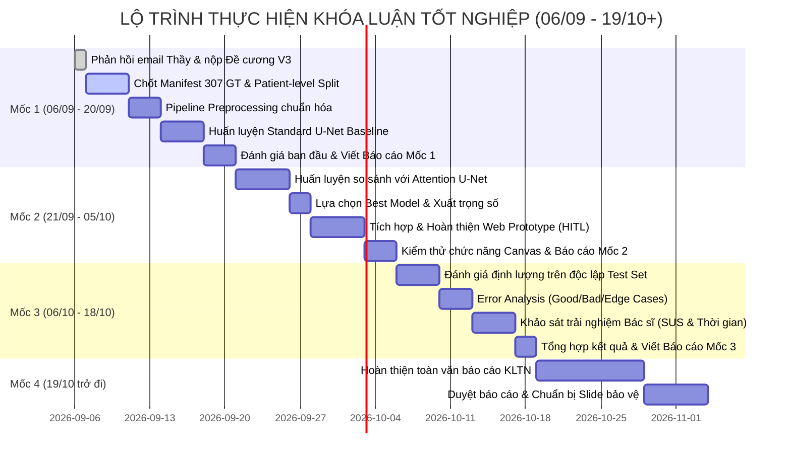

# Kế hoạch Triển khai Chi tiết Khóa luận Tốt nghiệp (2026)
> **Đề tài**: Xây dựng hệ thống hỗ trợ phân đoạn tổn thương trên ảnh siêu âm buồng trứng ứng dụng Deep Learning theo mô hình Human-in-the-Loop  
> **Sinh viên**: Nguyễn Hữu Dũng (MSV: 11235559, HTTTQL K65)  
> **Cán bộ hướng dẫn**: TS. Trần Thanh Hải  
> **Mốc thời gian quy định**: 06/09/2026 – 19/10+/2026  

---

## 1. Mục tiêu và Định hướng Trọng tâm (Goal Description)

Kế hoạch này thiết lập lộ trình hành động có cấu trúc chặt chẽ nhằm triển khai toàn diện Khóa luận Tốt nghiệp, tuân thủ đúng 4 mốc tiến độ bắt buộc theo email chỉ đạo của Thầy hướng dẫn ngày 06/09/2026.

### Nguyên tắc Bất biến (Non-negotiables)
1. **Khóa chặt phạm vi Cốt lõi (CORE MVP)**:
   $$\text{Raw Ultrasound} \longrightarrow \text{Preprocessing} \longrightarrow \text{Segmentation} \longrightarrow \text{Mask/Overlay} \longrightarrow \text{Review/Edit/Confirm} \longrightarrow \text{Evaluation}$$
2. **Loại bỏ dàn trải**: Tạm hoãn toàn bộ các module mở rộng (LLM/VLM, sinh chẩn đoán văn bản tự động, Dashboard phức tạp). Chỉ quay lại nếu hoàn tất CORE trước hạn.
3. **Kỷ luật Báo cáo Minh chứng**: Kết thúc mỗi mốc phải nộp báo cáo ngắn gọn kèm minh chứng thực nghiệm (log huấn luyện, bảng metrics, ảnh overlay, source code, prototype chạy được).

---

## 2. Các Hành động Khẩn cấp Cần Duyệt (User Review Required)

> [!IMPORTANT]
> **Hành động 1: Gửi email phản hồi Thầy ngay trong tối nay (06/09)**
> Thầy nhắc nhở nghiêm khắc về việc chưa nhận được phản hồi từ email ngày 03/09. Cần gửi email xin lỗi văn minh, kèm file đề cương đã chỉnh sửa hoàn hảo ([MSV_11235559_NguyenHuuDung_DeCuongSoBo.docx](file:///C:/Users/PeaceD/Downloads/MSV_11235559_NguyenHuuDung_DeCuongSoBo.docx)) và xác nhận cam kết thực hiện đúng Mốc 1 (06/09 – 20/09). *(Mẫu email đã được soạn thảo sẵn ở Mục 6)*.

> [!WARNING]
> **Hành động 2: Triển khai Standard U-Net làm mô hình Baseline**
> Hiện codebase đã có Attention U-Net (`checkpoints/best_attention_unet.pth`), nhưng đang thiếu mô hình `Standard U-Net` đóng vai trò Baseline đối chứng theo đúng chỉ đạo của Thầy. Cần viết module `backend/models/unet.py` và chạy thực nghiệm U-Net baseline ngay trong tuần này.

> [!NOTE]
> **Hành động 3: Thống nhất Nguồn dữ liệu Thực nghiệm**
> Bộ dữ liệu MMOTU hiện có 1.372 ảnh đã xác thực cấu trúc cặp ảnh-mask (`dataset/dataset/OTU_2D` và `OTU_CEUS`). Trong Mốc 1, pipeline sẽ khóa tập Ground Truth 307 ảnh (từ 185 bệnh nhân) làm trọng tâm chia Train/Val/Test theo Patient ID.

---

## 3. Lộ trình Triển khai Chi tiết theo 4 Mốc Thời gian



---

### MỐC 1: Dữ liệu + Preprocessing Pipeline + Mô hình Baseline (06/09 – 20/09)
**Mục tiêu**: Thiết lập pipeline thông suốt từ ảnh thô đến chỉ số đánh giá:  
$$\text{Raw Image/Mask} \longrightarrow \text{Preprocessing} \longrightarrow \text{Training} \longrightarrow \text{Prediction} \longrightarrow \text{Mask} \longrightarrow \text{Metrics (Dice, IoU, Recall)}$$

* [ ] **Nhiệm vụ 1.1 (06/09 - 09/09): Chốt và kiểm tra thống kê Dataset & Ground Truth**
  * File: `scripts/create_patient_level_splits.py`, `ai_training/splits/`
  * Khóa chặt manifest tập dữ liệu: 1.387 ảnh tiếp nhận $\rightarrow$ 417 có mask $\rightarrow$ 307 Ground Truth (thuộc 185 bệnh nhân).
  * Thực hiện phân chia Patient-level split theo tỷ lệ 70% Train (~215 ảnh / 130 bệnh nhân), 15% Val (~46 ảnh / 27 bệnh nhân), 15% Test (~46 ảnh / 28 bệnh nhân). Đảm bảo không trùng bệnh nhân giữa các tập.
  * Kiểm tra và phân loại 35 Empty Mask (ảnh âm tính) vào các tập đúng tỷ lệ.

* [ ] **Nhiệm vụ 1.2 (10/09 - 13/09): Hoàn thiện Preprocessing Pipeline**
  * File: `backend/services/preprocessor.py`, `ai_training/dataset_loader.py`
  * Đảm bảo thứ tự kỹ thuật bắt buộc: **(1) ROI Fan-beam Cropping** trên ảnh gốc $\rightarrow$ **(2) Letterbox Resize 512×512** (bilinear cho ảnh, nearest-neighbor cho mask) $\rightarrow$ **(3) Intensity Normalization về [0, 1]**.
  * Data Augmentation: Chỉ kích hoạt trên tập Train (xoay nhẹ, lật ngang, điều chỉnh tương phản an toàn); tuyệt đối không augmentation trên Validation và Test.
  * Sinh script kiểm tra trực quan (`scripts/generate_previews.py`) xuất 20 cặp ảnh-mask sau tiền xử lý để nghiệm thu.

* [ ] **Nhiệm vụ 1.3 (14/09 - 17/09): Triển khai và huấn luyện Standard U-Net Baseline**
  * File: `backend/models/unet.py`, `scripts/train_unet_baseline.py`
  * Hiện thực hóa kiến trúc Standard U-Net kinh điển (Ronneberger et al., 2015) gồm 4 tầng Encoder-Decoder với skip connections.
  * Huấn luyện với Combo Loss ($0.5 \cdot \text{Dice} + 0.5 \cdot \text{BCE}$), bộ tối ưu AdamW, Cosine Annealing Scheduler.
  * Lưu checkpoint tốt nhất tại: `checkpoints/baseline_unet_best.pth`.

* [ ] **Nhiệm vụ 1.4 (18/09 - 20/09): Đánh giá ban đầu & Viết Báo cáo Tiến độ Mốc 1**
  * Đo lường Dice, IoU, Recall trên tập Validation và Test.
  * Xuất file bảng số liệu và 10 ảnh dự đoán trực quan (Overlay mask thực tế vs Ground Truth).
  * Lập file báo cáo ngắn gọn `docs/reports/progress_report_milestone_1.md` gửi Thầy.

---

### MỐC 2: Mô hình So sánh + Tích hợp Web Functional Prototype (21/09 – 05/10)
**Mục tiêu**: So sánh thực nghiệm Baseline vs Mô hình cải tiến; tích hợp mô hình tối ưu vào Web Prototype với luồng tương tác Human-in-the-Loop hoàn chỉnh.

* [ ] **Nhiệm vụ 2.1 (21/09 - 25/09): Huấn luyện và Thực nghiệm Mô hình Cải tiến**
  * File: `backend/models/attention_unet.py`, `scripts/train_attention_unet.py`
  * Huấn luyện Attention U-Net trên cùng tập dữ liệu phân chia Patient-level của Mốc 1 để đảm bảo tính so sánh công bằng.
  * Đánh giá so sánh hiệu năng trên cùng Test set: U-Net vs Attention U-Net về Dice, IoU, Recall, HD95 và thời gian inference trên mỗi ảnh.

* [ ] **Nhiệm vụ 2.2 (26/09 - 27/09): Đóng gói Trọng số & Tích hợp Inference Engine**
  * File: `backend/services/inference_engine.py`
  * Chọn mô hình vượt trội để đưa vào prototype, cấu hình nạp trọng số tự động qua PyTorch/ONNX Runtime.
  * Đảm bảo thời gian suy luận phản hồi $\le 1.0$ giây/ảnh.

* [ ] **Nhiệm vụ 2.3 (28/09 - 02/10): Hoàn thiện Chức năng Lõi Web Functional Prototype (HITL)**
  * File: `frontend/index.html`, `frontend/js/modules/viewer.js`, `frontend/js/modules/review.js`
  * Luồng tương tác khép kín:
    1. **Upload**: Tải ảnh siêu âm (.png, .jpg, .dicom).
    2. **Segmentation**: Chạy suy luận tự động từ backend.
    3. **Overlay Viewer**: Hiển thị đồng thời ảnh gốc (Original) và lớp phủ ranh giới tổn thương (Mask/Overlay) với tùy chỉnh độ trong suốt (opacity).
    4. **Interactive Canvas**: Công cụ cọ vẽ (Brush) và tẩy xóa (Eraser) cho phép bác sĩ điều chỉnh trực tiếp đường bao mask.
    5. **Doctor Confirm**: Nút xác nhận lưu kết quả rà soát của bác sĩ trong môi trường thử nghiệm.
    6. **Export Report**: Xuất phiếu tóm tắt thông số kỹ thuật phân đoạn thử nghiệm phục vụ nghiên cứu.

* [ ] **Nhiệm vụ 2.4 (03/10 - 05/10): Kiểm thử Luồng & Viết Báo cáo Tiến độ Mốc 2**
  * Chạy test tự động toàn bộ API backend (`pytest tests/test_v1_endpoints.py`, `pytest tests/test_api.py`).
  * Quay video ngắn (1-2 phút) hoặc chụp chuỗi ảnh minh chứng luồng upload $\rightarrow$ inference $\rightarrow$ edit $\rightarrow$ confirm.
  * Lập báo cáo `docs/reports/progress_report_milestone_2.md` gửi Thầy.

---

### MỐC 3: Kiểm thử, Phân tích Lỗi & Đánh giá Toàn diện (06/10 – 18/10)
**Mục tiêu**: Thu thập số liệu định lượng, phân tích sai số mô hình và tiến hành kiểm chứng tính hữu dụng với người dùng chuyên môn.

* [ ] **Nhiệm vụ 3.1 (06/10 - 09/10): Đánh giá Định lượng Chi tiết trên Test Set**
  * File: `scripts/generate_evaluation_artifacts.py`
  * Xuất bảng phân bố chỉ số hiệu năng trên từng ca bệnh (per-case metrics): Dice, IoU, Precision, Recall, Specificity.
  * Kiểm tra riêng biệt hiệu năng trên 35 ca âm tính (Empty Mask) để đo tỷ lệ False Positive.

* [ ] **Nhiệm vụ 3.2 (10/10 - 12/10): Phân tích Sai số (Error Analysis)**
  * Phân loại các trường hợp:
    * Nhóm xuất sắc ($\text{Dice} \ge 0.90$): Đặc điểm hình thái tổn thương rõ nét.
    * Nhóm trung bình ($0.70 \le \text{Dice} < 0.90$).
    * Nhóm sai số lớn ($\text{Dice} < 0.70$): Phân tích nguyên nhân (nhiễu speckle nặng, ranh giới tiêu âm, kích thước tổn thương quá nhỏ).
  * Trực quan hóa hình ảnh đối sánh: Input - Ground Truth - AI Prediction - Difference Map.

* [ ] **Nhiệm vụ 3.3 (13/10 - 16/10): Đánh giá Thử nghiệm với Bác sĩ (Human-in-the-Loop Usability)**
  * Thiết lập kịch bản thử nghiệm 10 ca điển hình cho bác sĩ chuyên khoa thao tác trên prototype.
  * Ghi nhận các chỉ số:
    * Thời gian hoàn thành tác vụ (Task Completion Time).
    * Tỷ lệ ca bác sĩ chấp nhận ngay kết quả của AI vs ca cần chỉnh sửa.
    * Đánh giá độ khả dụng qua thang đo khảo sát chuẩn **SUS (System Usability Scale)**.

* [ ] **Nhiệm vụ 3.4 (17/10 - 18/10): Tổng hợp Kết quả & Báo cáo Mốc 3**
  * Lập báo cáo tiến độ Mốc 3 (`docs/reports/progress_report_milestone_3.md`) với đầy đủ bảng biểu, đồ thị và kết quả phỏng vấn bác sĩ.

---

### MỐC 4: Hoàn thiện Toàn văn Báo cáo & Chuẩn bị Bảo vệ (19/10 trở đi)
**Mục tiêu**: Viết toàn văn khóa luận tốt nghiệp theo cấu trúc 5 chương đã được duyệt trong Đề cương V3, chuẩn bị slide và demo.

* [ ] **Tuần 1 (19/10 - 25/10)**: Viết Chương 1 (Tổng quan & Cơ sở lý luận) và Chương 2 (Phân tích nghiệp vụ & SRS).
* [ ] **Tuần 2 (26/10 - 01/11)**: Viết Chương 3 (Nghiên cứu & Huấn luyện mô hình AI) và Chương 4 (Hiện thực hóa Prototype).
* [ ] **Tuần 3 (02/11 - 08/11)**: Viết Chương 5 (Thử nghiệm, Đánh giá kết quả & Thảo luận), Kết luận và Phụ lục.
* [ ] **Tuần 4 (09/11 trở đi)**: Rà soát định dạng toàn văn theo chuẩn NEU, in ấn bản thảo gửi Thầy duyệt, làm slide thuyết trình và luyện tập bảo vệ thử.

---

## 4. Kế hoạch Kiểm thử & Xác minh (Verification Plan)

### Kiểm thử Tự động (Automated Tests)
Chạy các bộ kiểm thử đã có trong dự án để đảm bảo tính toàn vẹn hệ thống:
```powershell
# 1. Kiểm tra tính toàn vẹn pipeline và rò rỉ dữ liệu
.\.venv\Scripts\pytest tests/test_ai_pipeline_integrity.py -v

# 2. Kiểm tra các cổng logic kiểm soát chất lượng phân đoạn
.\.venv\Scripts\pytest tests/test_segmentation_quality_gate.py -v

# 3. Kiểm tra toàn bộ API backend phục vụ Web Prototype
.\.venv\Scripts\pytest tests/test_v1_endpoints.py -v
```

### Tiêu chí Nghiệm thu Từng Mốc (Definition of Done)
* **Mốc 1**: Có file manifest chia bệnh nhân `train.csv`, `val.csv`, `test.csv` không rò rỉ; có file `checkpoints/baseline_unet_best.pth`; xuất được bảng log Dice/IoU/Recall chạy thực tế trên tập Test.
* **Mốc 2**: Server FastAPI khởi chạy mượt mà, frontend load được ảnh, click chạy phân đoạn hiển thị mask overlay $\le 1$s, các nút cọ vẽ/tẩy và xác nhận hoạt động ổn định.
* **Mốc 3**: Có file phân tích per-case CSV, biểu đồ phân bố Dice, các case đối chuẩn ảnh trực quan và biên bản/phiếu khảo sát SUS từ bác sĩ.

---

## 5. Mẫu Báo cáo Tiến độ Ngắn Sau Mỗi Mốc (Progress Report Template)

Mỗi khi đến hạn mốc, sinh viên chỉ cần điền vào mẫu sau (dài khoảng 1-2 trang A4) gửi Thầy:

```markdown
# BÁO CÁO TIẾN ĐỘ THỰC HIỆN KLTN - [MỐC ...]
* Ngày báo cáo: [DD/MM/2026]
* Sinh viên: Nguyễn Hữu Dũng (11235559)

1. CÁC HẠNG MỤC ĐÃ HOÀN THÀNH
- [Liệt kê ngắn gọn 3-4 đầu việc chính đã làm]

2. KẾT QUẢ THỰC NGHIỆM & MINH CHỨNG
- Bảng chỉ số định lượng: [Dice, IoU, Recall...]
- Minh chứng kỹ thuật: [Ảnh chụp màn hình training log / Ảnh kết quả overlay mask / Link commit github]

3. VẤN ĐỀ & RỦI RO ĐANG GẶP (NẾU CÓ)
- [Nêu khó khăn thực tế về dữ liệu, mô hình hoặc kết nối chuyên gia]

4. KẾ HOẠCH CHO GIAI ĐOẠN TIẾP THEO
- [Nêu 3-4 đầu việc trọng tâm sẽ giải quyết trong mốc kế tiếp]
```

---

## 6. Dự thảo Email Gửi Thầy Hướng dẫn (Gửi Ngay Tối Nay 06/09)

```text
Tiêu đề: [KLTN] Báo cáo tiếp thu ý kiến, nộp Đề cương V3 hoàn thiện và Kế hoạch triển khai - SV Nguyễn Hữu Dũng (11235559)

Kính gửi: ThS. Trần Thanh Hải,

Em xin chân thành cảm ơn Thầy đã đọc kỹ và gửi cho em các nhận xét rất chi tiết, xác đáng trong email vừa qua. Em cũng xin phép gửi lời xin lỗi chân thành đến Thầy vì đã phản hồi chậm trễ qua email, khiến Thầy phải phiền lòng và nhắc nhở về thái độ học tập của em.

Trong những ngày qua, em đã nghiêm túc nghiên cứu từng điểm chỉ đạo của Thầy và tập trung rà soát, chỉnh sửa lại toàn bộ tài liệu Đề cương sơ bộ V3. Em xin báo cáo với Thầy các nội dung em đã khắc phục triệt để:

1. Về tên đề tài và phạm vi cốt lõi: Em đã khóa hoàn toàn tên đề tài chính thức là: “Xây dựng hệ thống hỗ trợ phân đoạn tổn thương trên ảnh siêu âm buồng trứng ứng dụng Deep Learning theo mô hình Human-in-the-Loop.” Toàn bộ văn bản đã được chuẩn hóa nhất quán theo định hướng “hỗ trợ phân đoạn / khoanh vùng tổn thương” trong quy trình đọc ảnh siêu âm, tuyệt đối không tuyên bố chẩn đoán tự động. Phần sinh mô tả và dashboard được tách biệt hoàn toàn sang mục mở rộng.
2. Về số liệu dữ liệu: Em đã chuẩn hóa bảng dữ liệu đúng thứ bậc: Tổng tiếp nhận 1.387 ảnh -> 417 ảnh có mask -> 307 ảnh Ground Truth do bác sĩ xác nhận (thuộc 185 bệnh nhân, trong đó có 35 ảnh âm tính/empty mask để học chống False Positive) -> 110 ảnh pending lưu riêng -> 970 ảnh thô.
3. Về tiền xử lý và mô hình: Em đã mô tả chính xác thứ tự kỹ thuật: Cắt quạt ROI độc lập trên ảnh gốc -> Letterbox Resize về 512×512; phân chia Train/Val/Test theo Patient ID trước khi thực hiện Data Augmentation trên tập Train. Về mô hình, em khóa cấu trúc: Standard U-Net làm baseline và thực nghiệm 1 mô hình cải tiến để so sánh trên cùng tập Test bằng Dice, IoU, Recall.
4. Về bản chất sản phẩm: Em định vị thống nhất đây là “Web Functional Prototype phục vụ nghiên cứu thử nghiệm”, các thao tác xác nhận và xuất phiếu là phục vụ thử nghiệm học thuật, không đại diện cho ký duyệt chẩn đoán y tế chính thức. Đồng thời, toàn bộ văn bản đã được căn chỉnh đúng quy cách định dạng luận văn của Khoa và Trường.

Em xin kính gửi Thầy file Đề cương sơ bộ V3 hoàn thiện đính kèm thư này:
- File đính kèm: MSV_11235559_NguyenHuuDung_DeCuongSoBo.docx

Đồng thời, em xin xác nhận tiếp thu 100% các mốc tiến độ Thầy đã giao. Ngay từ tuần này (06/09 – 20/09), em sẽ tập trung toàn lực hoàn thiện pipeline dữ liệu và huấn luyện mô hình U-Net baseline để có kết quả thực nghiệm báo cáo Thầy đúng hạn vào ngày 20/09.

Em kính mong Thầy xem xét bản đề cương cập nhật và tiếp tục chỉ dẫn cho em trong quá trình thực hiện.

Kính chúc Thầy nhiều sức khỏe và công tác tốt.

Em,
Nguyễn Hữu Dũng
MSV: 11235559 - Lớp HTTTQL 65A
Số điện thoại: [Số điện thoại của bạn]
```
