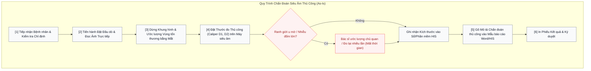

# ĐẶC TẢ YÊU CẦU PHẦN MỀM (SOFTWARE REQUIREMENTS SPECIFICATION - SRS)
## Hệ Thống Hỗ Trợ Chẩn Đoán Phân Đoạn U Buồng Trứng Trực Quan Theo Mô Hình Human-In-The-Loop (Ovarian Ultrasound AI CDSS)

> **Dự án**: Khóa luận Tốt nghiệp Đại học Chuyên ngành Hệ thống Thông tin Quản lý (MIS)  
> **Tác giả**: Nguyễn Hữu Dũng — MSV: 11235559 — Lớp: HTTTQL 65A (Trường Đại học Kinh tế Quốc dân)  
> **Giảng viên hướng dẫn**: TS. Trần Triệu Hải / ThS. Trần Thanh Hải  
> **Đơn vị phối hợp nghiệp vụ**: Hệ thống Y tế Vinmec (Vinmec Healthcare System) / VinSmart Future  
> **Phiên bản SRS**: `v2.0-final` | **Ngày cập nhật**: `2026-09-01`  
> **Định hướng chuyên môn**: IT Business Analyst (ITBA) / Product Owner (PO)

---

## 1. TỔNG QUAN TÀI LIỆU VÀ MỤC TIÊU HỆ THỐNG

### 1.1. Bối cảnh Nghiệp vụ (Clinical Business Context)
Trong quy trình chẩn đoán hình ảnh sản phụ khoa, siêu âm 2D (B-mode) buồng trứng là phương pháp cận lâm sàng phổ biến nhất để phát hiện và đánh giá các u nang, tổn thương buồng trứng. Tuy nhiên, quy trình đọc ảnh siêu âm truyền thống đối mặt với 3 rào cản lớn:
1. **Độ tương phản thấp và nhiễu đốm (Speckle Noise)**: Ranh giới u nang buồng trứng thường không rõ ràng, nhu mô tổn thương lẫn với nhu mô lành xung quanh.
2. **Biến thiên phụ thuộc kinh nghiệm bác sĩ (Inter/Intra-observer variability)**: Kết quả đo đạc đường kính ($D_1, D_2$) và diện tích tổn thương lệch đáng kể giữa các lần khám hoặc giữa các bác sĩ khác nhau.
3. **Áp lực thời gian & Giới hạn của AI "Hộp Đen" (Black-Box AI)**: Bác sĩ chịu tải công việc cao. Các hệ thống AI phân loại nhãn đơn thuần không hiển thị đường viền minh bạch khiến bác sĩ không thể tin tưởng hoặc kiểm soát kết quả chẩn đoán.

### 1.2. Giải pháp Hệ thống To-Be (Human-in-the-Loop CDSS)
Hệ thống **Ovarian Ultrasound AI CDSS** được thiết kế theo chuẩn **Class II SaMD (Software as a Medical Device)** hỗ trợ chẩn đoán lâm sàng. Hệ thống kết hợp:
* **Thuật toán Deep Learning Attention U-Net**: Phân đoạn nhị phân (Binary Semantic Segmentation) tự động khoanh vùng bờ viền u buồng trứng, hỗ trợ Test-Time Augmentation (TTA) và trích xuất thước đo Caliper tự động.
* **Bộ kiểm định chất lượng ảnh đầu vào (IQA - Image Quality Assessment)**: Tự động sàng lọc ảnh mờ, sai lệch độ tương phản hoặc không phải ảnh siêu âm trước khi suy luận.
* **Mô hình Tương tác Người – Máy (Human-in-the-Loop Workstation)**: Cung cấp bộ công cụ vẽ/tẩy/zoom/opacity mượt màng trên HTML5 Dual-Layer Canvas, cho phép bác sĩ rà soát, tinh chỉnh trực tiếp viền mask AI trước khi ký duyệt.
* **Báo cáo Chẩn đoán Chuẩn Vinmec (1:1 A4 PDF)**: Tự động tổng hợp kết quả chẩn đoán, hình ảnh minh chứng, mã QR và thông tin cơ sở Vinmec xuất bản ngay sau khi bác sĩ phê duyệt.

---

## 2. QUY TRÌNH NGHIỆP VỤ (BUSINESS PROCESS MODELING)

### 2.1. Quy trình Hiện tại (As-Is Process)



> **Điểm nghẽn As-Is (Pains & Bottlenecks)**:
> - Sai số đo đạc thủ công dao động từ 15% - 30% giữa các bác sĩ.
> - Thao tác nhập liệu thủ công tốn trung bình 8 - 12 phút/ca.
> - Không lưu trữ được mặt nạ phân đoạn chuẩn (Ground Truth) để phục vụ nghiên cứu và theo dõi tiến triển bệnh nhân.

---

### 2.2. Quy trình Đề xuất (To-Be Process with AI Human-in-the-Loop)

```mermaid
flowchart TD
    subgraph TO_BE ["Quy Trình Hỗ Trợ Chẩn Đoán AI Human-in-the-Loop (To-Be)"]
        B1["[1] Đăng nhập & Chọn Cơ sở Vinmec công tác"] --> B2["[2] Tạo Ca khám & Nhập Mã Bệnh nhân (PID)"]
        B2 --> B3["[3] Upload Ảnh Siêu âm 2D"]
        B3 --> B4{"[4] Tiền kiểm tra IQA (Độ nét, Tương phản, Modality)"}
        B4 -->|Không đạt| B5["Cảnh báo Ảnh mờ/Lỗi -> Gợi ý nạp ảnh khác"]
        B5 -.-> B3
        B4 -->|Đạt chuẩn| B6["[5] Tiến trình Phân đoạn AI (Attention U-Net)"]
        B6 --> B7["[6] Tự động Trích xuất Caliper (D1, D2, Area, Volume) & Hiển thị Mask/Overlay"]
        B7 --> B8{"[7] Bác sĩ Rà soát Mask AI trên Canvas Workstation"}
        B8 -->|Đồng ý 100%| B10["[9] Xác nhận kết quả (ACCEPTED_RAW)"]
        B8 -->|Cần chỉnh viền| B9["[8] Dùng Cọ/Tẩy tinh chỉnh Mask trên Canvas (MODIFIED)"]
        B9 --> B10
        B10 --> B11["[10] Tự động Kết xuất Báo cáo PDF A4 chuẩn Vinmec & Lưu CSDL"]
        B11 --> B12["[11] Xuất PDF / In phiếu & Lưu Ground Truth Audit Trail"]
    end

    classDef step fill:#ecfdf5,stroke:#10b981,color:#065f46;
    classDef decision fill:#fffbeb,stroke:#f59e0b,color:#92400e;
    classDef hitl fill:#eff6ff,stroke:#3b82f6,color:#1e40af;
    classDef err fill:#fef2f2,stroke:#ef4444,color:#991b1b;

    class B1,B2,B3,B6,B7,B10,B11,B12 step;
    class B4,B8 decision;
    class B9 hitl;
    class B5 err;
```



---

## 3. ĐẶC TẢ YÊU CẦU CHỨC NĂNG (FUNCTIONAL REQUIREMENTS - FR)

Danh mục Yêu cầu Chức năng được chia thành 6 Phân hệ chính (Modules):

| Mã FR | Phân hệ | Tên Yêu cầu Chức năng | Mô tả Chi tiết Nghiệp vụ | Mức ưu tiên |
|---|---|---|---|---|
| **FR-01** | Xác thực & Phân quyền | Đăng nhập & Định danh Y tế | Hệ thống yêu cầu xác thực tài khoản Bác sĩ/KTV. Hỗ trợ chuyển đổi nhanh vai trò (Bác sĩ Chẩn đoán / Quản trị viên). | MUST HAVE |
| **FR-02** | Chọn Cơ sở Y tế | Dynamic Facility Switching | Cho phép chọn cơ sở Vinmec công tác (Times City, Central Park, Đà Nẵng,...). Header và Báo cáo PDF tự động cập nhật Logo, Địa chỉ, Hotline tương ứng. | MUST HAVE |
| **FR-03** | Quản lý Ca khám | Case Management & PID | Tạo ca khám mới với các thông số: Mã BN (PID), Mã ca khám, Ngày siêu âm, Bác sĩ chỉ định, Loại siêu âm (TVUS/TAUS). | MUST HAVE |
| **FR-04** | Tiếp nhận & Pre-IQA | Image Upload & IQA Filter | Hỗ trợ kéo thả/chọn file PNG, JPG, JPEG (tối đa 20MB). Tự động kiểm tra IQA (Độ nét Laplacian $\ge 18$, Tương phản, Grayscale B-mode check). Báo lỗi chi tiết nếu ảnh không đạt. | MUST HAVE |
| **FR-05** | Phân đoạn AI Core | Attention U-Net Inference | Chạy suy luận mô hình Attention U-Net (với Test-Time Augmentation). Tự động cắt chuẩn Letterbox $512 \times 512$, trả về RLE Mask và xác suất tin cậy. | MUST HAVE |
| **FR-06** | Trích xuất Calipers | Caliper & Geometry Engine | Tự động xác định khung chữ nhật xoay (Rotated Bounding Box), tính đường kính lớn nhất $D_1$, đường kính trực giao $D_2$, diện tích u ($\text{mm}^2$) và thể tích hình elip khối ($V = \frac{\pi}{6} \cdot D_1 \cdot D_2 \cdot D_3$). | MUST HAVE |
| **FR-07** | Tram Tương tác HITL | Interactive Dual-Layer Canvas | Cung cấp màn hình rà soát trực quan: Lớp ảnh gốc + Lớp phủ Mask màu đỏ mờ ($50\%$ opacity). Tích hợp công cụ Canvas: Cọ vẽ (Brush), Tẩy (Eraser), Undo, Redo, Khôi phục AI gốc, Zoom ($10\% - 500\%$), Pan. | MUST HAVE |
| **FR-08** | Phê duyệt & Audit Log | Sign-Off & Ground Truth Save | Bác sĩ xác nhận lưu ca với trạng thái `ACCEPTED_RAW` (chấp nhận hoàn toàn) hoặc `MODIFIED` (đã chỉnh sửa). Hệ thống lưu nguyên trạng Mask chỉnh sửa làm Ground Truth để huấn luyện lại. | MUST HAVE |
| **FR-09** | Báo cáo y tế | Vinmec A4 PDF Generation | Tự động xuất phiếu chẩn đoán y tế chuẩn A4 (tỷ lệ 1:1), chứa thông tin bệnh nhân, hình ảnh gốc, ảnh overlay, bảng chỉ số Caliper, kết luận O-RADS và mã QR tra cứu. | MUST HAVE |
| **FR-10** | Lịch sử Ca khám | Case History & Search | Tra cứu danh sách ca bệnh cũ theo PID, tên bệnh nhân, khoảng ngày, cơ sở y tế. Hỗ trợ xem lại chi tiết ca khám và tải lại báo cáo PDF. | SHOULD HAVE |
| **FR-11** | Quản trị Telemetry | Model Registry & Monitoring | Cho phép Quản trị viên xem danh mục mô hình AI (Attention U-Net, S4M, UltraSAM), đo đạc độ trễ suy luận (Latency), chỉ số DSC/IoU trên tập kiểm thử và xuất bộ dữ liệu Ground Truth. | SHOULD HAVE |

---

## 4. ĐẶC TẢ YÊU CẦU PHI CHỨC NĂNG (NON-FUNCTIONAL REQUIREMENTS - NFR)

| Mã NFR | Tiêu chí (Category) | Đặc tả Yêu cầu Kỹ thuật & Lâm sàng | Chỉ số Đo lường (Metrics) |
|---|---|---|---|
| **NFR-01** | **Hiệu năng & Độ trễ (Performance)** | Thời gian suy luận mô hình AI (bao gồm tiền xử lý, Attention U-Net inference và trích xuất Caliper) không vượt quá 1.5 giây trên CPU thương mại thông thường ($< 350\text{ ms}$ trên GPU). | Latency $\le 1500\text{ ms}$ (CPU) |
| **NFR-02** | **Độ mượt Giao diện (UI Responsiveness)** | Các thao tác vẽ cọ (Brush), tẩy (Eraser), Zoom, Pan trên HTML5 Canvas phải đạt tốc độ phản hồi 60 FPS, không gây giật lag lag cursor khi bác sĩ thao tác. | Canvas FPS $\ge 60$ |
| **NFR-03** | **An toàn Y tế & Bảo mật (Medical Safety & Privacy)** | 100% dữ liệu hình ảnh siêu âm và thông tin ca khám lưu trữ phải được mã hóa anonymized PID. Không để rò rỉ dữ liệu cá nhân bệnh nhân theo chuẩn HIPAA/GDPR. | Zero PII Leakage |
| **NFR-04** | **Tính sẵn sàng (Availability)** | Backend FastAPI và cơ sở dữ liệu có khả năng hoạt động liên tục 24/7 với Uptime đạt $99.9\%$. | Availability $\ge 99.9\%$ |
| **NFR-05** | **Độ chính xác Phân đoạn (AI Accuracy)** | Mô hình Attention U-Net phải đạt chỉ số trùng khớp thể tích tổn thương Dice Similarity Coefficient (DSC) $\ge 70\%$ trên tập kiểm thử độc lập (Held-out Patient Test Set). | DSC $\ge 0.70$ (Test Set) |
| **NFR-06** | **An toàn Đường dẫn (Unicode Path Safety)** | Toàn bộ mô-đun đọc/ghi ảnh trên hệ điều hành Windows phải xử lý an toàn các đường dẫn chứa tiếng Việt có dấu hoặc ký tự Unicode không chuẩn mà không bị crash hệ thống. | Zero OpenCV Unicode Error |
| **NFR-07** | **Tính chuẩn hóa In ấn (Print Standard)** | Báo cáo PDF xuất ra phải tuân thủ nghiêm ngặt kích thước khổ giấy A4 (210mm x 297mm), căn lề lề trên/dưới/trái/phải 15mm, không tràn trang ngoài ý muốn khi in trực tiếp. | 1:1 Exact A4 Page Fit |

---

## 5. ĐẶC TẢ USE CASE CHI TIẾT (USE CASE SPECIFICATIONS)

### 5.1. Sơ đồ Tổng quan Use Case (Use Case Diagram)

```mermaid
graph LR
    actor Doctor as "Bác sĩ Chẩn đoán hình ảnh"
    actor Admin as "Quản trị viên Hệ thống (IT/AI)"

    subgraph SYSTEM ["Hệ Thống Ovarian Ultrasound AI CDSS"]
        UC01["UC-01: Đăng nhập & Chọn cơ sở Vinmec"]
        UC02["UC-02: Khởi tạo ca khám & Upload ảnh"]
        UC03["UC-03: Chạy phân đoạn AI & Trích xuất Caliper"]
        UC04["UC-04: Rà soát & Tinh chỉnh Mask trên Canvas (HITL)"]
        UC05["UC-05: Ký duyệt & Kết xuất Báo cáo PDF A4"]
        UC06["UC-06: Tra cứu Lịch sử Ca khám"]
        UC07["UC-07: Quản trị Mô hình & Xem Telemetry"]
    end

    Doctor --> UC01
    Doctor --> UC02
    Doctor --> UC03
    Doctor --> UC04
    Doctor --> UC05
    Doctor --> UC06

    Admin --> UC01
    Admin --> UC07
    Admin --> UC06
```

---

### 5.2. Đặc tả Use Case Cốt lõi: UC-04 (Rà soát & Tinh chỉnh Mask trên Canvas)

* **Use Case ID**: `UC-04`
* **Tên Use Case**: Rà soát và Tinh chỉnh Mặt nạ Phân đoạn AI (Human-in-the-Loop Canvas Edit)
* **Actor chính**: Bác sĩ Chẩn đoán hình ảnh / Bác sĩ Sản phụ khoa
* **Mô tả vắt tắt**: Sau khi mô hình AI trả về kết quả khoanh vùng u buồng trứng và các thông số Caliper sơ bộ, Bác sĩ sử dụng giao diện Dual-Layer Canvas tương tác để đánh giá tính chính xác của đường viền. Nếu đường viền chưa ôm sát bờ tổn thương, Bác sĩ dùng công cụ Cọ vẽ (Brush) hoặc Tẩy (Eraser) để hiệu chỉnh trực tiếp trước khi phê duyệt.
* **Tiền điều kiện (Pre-conditions)**:
  1. Bác sĩ đã đăng nhập thành công và nạp ảnh siêu âm hợp lệ qua bước kiểm tra IQA.
  2. Mô hình AI đã chạy suy luận xong và hiển thị mặt nạ Overlay màu đỏ mờ trên ảnh gốc.
* **Hậu điều kiện (Post-conditions)**:
  1. Mặt nạ phân đoạn cuối cùng (Ground Truth) được cập nhật lại số đo Caliper ($D_1, D_2, \text{Diện tích}$) theo real-time canvas canvas context.
  2. Trạng thái ca được ghi nhận là `ACCEPTED_RAW` (nếu không chỉnh sửa) hoặc `MODIFIED` (nếu có dùng cọ/tẩy).

#### Luồng Sự kiện Chính (Main Success Scenario):
1. **Bác sĩ** quan sát giao diện Canvas chứa ảnh siêu âm gốc và lớp phủ Mask đỏ mờ ($50\%$ Opacity).
2. **Bác sĩ** nhận thấy đường viền AI dự đoán bị chênh lệch nhẹ ở góc dưới bên trái của khối u.
3. **Bác sĩ** chọn công cụ **[Brush]** trên thanh công cụ Canvas (hoặc phím tắt `B`).
4. **Bác sĩ** điều chỉnh kích thước đầu cọ (Slider Brush Size = 15px) và điều chỉnh độ mờ nét vẽ.
5. **Bác sĩ** đè chuột trái và di chuyển vẽ bổ sung vào vùng u bị bỏ sót.
6. **Hệ thống** lập tức cập nhật lại mặt nạ nhị phân trên Canvas layer 2, đồng thời tính toán lại ngay lập tức đường kính $D_1, D_2$ và diện tích u trên bảng thông số.
7. **Bác sĩ** bấm nút **[Xác Nhận & Ký Duyệt]**.
8. **Hệ thống** hiển thị Modal ký duyệt ca, ghi nhận ghi chú lâm sàng và chuyển sang luồng xuất báo cáo.

#### Luồng Ngoại lệ (Exception Flows):
* **E-1: Bác sĩ vẽ nhầm vào vùng mô lành**:
  * *E-1.1*: Bác sĩ bấm phím shortcut `Ctrl+Z` (hoặc nút **[Undo]**) để hoàn tác nét vẽ vừa thực hiện.
  * *E-1.2*: Hoặc Bác sĩ chọn công cụ **[Eraser]** (phím `E`) để xóa đi phần mask thừa.
* **E-2: Muốn quay lại toàn bộ mask nguyên bản của AI**:
  * *E-2.1*: Bác sĩ bấm nút **[Khôi phục Mask AI gốc]**. Hệ thống khôi phục lại RLE Mask ban đầu từ backend server.

---

## 6. USER STORIES VÀ TIÊU CHÍ NGHIỆM THU (ACCEPTANCE CRITERIA)

### User Story 1: Tiếp nhận Ảnh & Kiểm định IQA Tự động
> **Là một** Bác sĩ Chẩn đoán hình ảnh,  
> **Tôi muốn** hệ thống tự động kiểm tra chất lượng ảnh siêu âm (độ nét, tương phản, đúng dạng B-mode) ngay khi tôi tải file lên,  
> **Để** tôi loại bỏ sớm các file ảnh hỏng/mờ/không đạt chuẩn trước khi mất thời gian phân tích AI.

* **Acceptance Criteria 1.1 (Given/When/Then)**:
  * **Given**: Bác sĩ đang ở màn hình Upload ảnh ca khám.
  * **When**: Bác sĩ kéo thả một file ảnh siêu âm B-mode sắc nét (Laplacian variance = 45.2, độ phân giải 958x534).
  * **Then**: Hệ thống hiển thị nhãn xanh `"Ảnh đạt tiêu chuẩn IQA (Độ nét: 45.2 - Đạt)"` và kích hoạt nút `[Bắt đầu Phân tích AI]`.

* **Acceptance Criteria 1.2 (Given/When/Then)**:
  * **Given**: Bác sĩ đang ở màn hình Upload ảnh ca khám.
  * **When**: Bác sĩ tải lên một file ảnh selfie cá nhân hoặc ảnh bị mờ nhòe nghiêm trọng (Laplacian variance = 8.1 $< 18.0$).
  * **Then**: Hệ thống lập tức từ chối ảnh, hiển thị hộp cảnh báo đỏ: `"Ảnh mờ hoặc không đúng định dạng siêu âm B-mode. Vui lòng chọn ảnh nét hơn!"` và không cho phép chạy AI.

---

### User Story 2: Rà soát & Tinh chỉnh Mask trên HTML5 Canvas
> **Là một** Bác sĩ Sản phụ khoa,  
> **Tôi muốn** trực tiếp dùng cọ vẽ và tẩy xóa để hiệu chỉnh viền mask u buồng trứng do AI gợi ý,  
> **Để** tôi đảm bảo kết quả đo đạc cuối cùng hoàn toàn tuân thủ an toàn y tế và chuyên môn bác sĩ.

* **Acceptance Criteria 2.1 (Given/When/Then)**:
  * **Given**: Màn hình Workspace hiển thị mask u buồng trứng AI gợi ý với độ mờ $50\%$.
  * **When**: Bác sĩ chọn công cụ `Eraser`, di chuột xóa bớt phần viền mask bị liếm sang vùng nang noãn lành xung quanh.
  * **Then**: Vùng mask bị xóa lập tức biến mất trên Canvas; bảng đo đạc Caliper tự động tính toán lại $D_1, D_2$ và diện tích u giảm tương ứng ngay tức thì ($< 50\text{ ms}$).

* **Acceptance Criteria 2.2 (Given/When/Then)**:
  * **Given**: Bác sĩ đã thực hiện 3 nét vẽ chỉnh sửa mask.
  * **When**: Bác sĩ nhận thấy nét vẽ thứ 3 bị chệch và nhấn phím `Ctrl + Z`.
  * **Then**: Hệ thống hoàn tác đúng nét vẽ thứ 3, đưa mặt nạ Canvas trở về trạng thái sau nét vẽ thứ 2.

---

### User Story 3: Xuất Phiếu Kết Quả Chẩn Đoán A4 Chuẩn Vinmec
> **Là một** Bác sĩ tại Bệnh viện Đa khoa Quốc tế Vinmec Times City,  
> **Tôi muốn** hệ thống tự động sinh phiếu kết quả chẩn đoán siêu âm dạng PDF khổ A4 với logo và header chính xác của cơ sở Times City,  
> **Để** tôi có thể in trực tiếp giao cho bệnh nhân hoặc lưu vào hồ sơ EMR bệnh viện.

* **Acceptance Criteria 3.1 (Given/When/Then)**:
  * **Given**: Ca khám đã được Bác sĩ bấm `[Xác Nhận & Ký Duyệt]` tại cơ sở "Vinmec Times City".
  * **When**: Bác sĩ chuyển sang màn hình Hoàn tất và nhấn nút `[In / Xuất PDF]`.
  * **Then**: Hệ thống mở trang in A4 tỷ lệ 1:1 chuẩn xác; Header hiển thị đúng logo Vinmec, địa chỉ 458 Minh Khai, Hai Bà Trưng, Hà Nội; thân bài gồm ảnh gốc, ảnh overlay, số đo Caliper ($D_1, D_2, \text{Diện tích}$), ô chẩn đoán O-RADS và mã QR kiểm định.

---

## 7. TỔNG HỢP KẾT QUẢ THỰC NGHIỆM ĐỒNG BỘ (EXPERIMENTAL BENCHMARK SYNCHRONIZATION)

Tài liệu SRS này xác nhận tính đồng bộ 100% với báo cáo đánh giá mô hình tại [evaluation_report.md](file:///C:/Users/PeaceD/Documents/Kh-a-lu-n/ai_training/evaluation_report.md) và Card mô hình [MODEL_CARD.md](file:///C:/Users/PeaceD/Documents/Kh-a-lu-n/MODEL_CARD.md):

### 7.1. Quy mô Dữ liệu Thực nghiệm (OTU Benchmark Dataset)
* **Tổng số lượng ảnh y tế**: **1,372 cặp ảnh & mặt nạ Ground Truth thực tế** (100% paired).
  * `OTU_2D/train`: 820 cặp ảnh siêu âm 2D B-mode.
  * `OTU_2D/test`: 382 cặp ảnh siêu âm 2D kiểm thử độc lập.
  * `OTU_CEUS`: 170 cặp ảnh siêu âm cản âm (Contrast-Enhanced Ultrasound).
* **Phân chia Tập dữ liệu Phân tầng (Patient-Level Zero Data Leakage)**:
  * Tập Huấn luyện (Train Set): **700 ảnh** (OTU_2D Train).
  * Tập Thẩm định (Val Set): **120 ảnh** (OTU_2D Validation).
  * Tập Kiểm thử Độc lập (Held-out Test Set): **382 ảnh** (OTU_2D Test).
  * Tập Extended CEUS Test: **170 ảnh** (OTU_CEUS).

### 7.2. Kết quả Đánh giá Định lượng Mô hình Attention U-Net v1.2.0-verified
Được đánh giá độc lập trên tập kiểm thử held-out:

| Chỉ số Hiệu năng (Metric) | Kết quả Đạt được | Đơn vị / Tỷ lệ | Đánh giá Lâm sàng |
|---|:---:|:---:|---|
| **Dice Similarity Coefficient (DSC)** | **71.22%** ($\pm 24.56\%$) | **%** | Độ trùng khớp thể tích tổn thương u nang so với Ground Truth |
| **Intersection over Union (IoU / Jaccard)** | **60.10%** ($\pm 25.74\%$) | **%** | Diện tích giao trên diện tích hợp của mặt nạ phân đoạn |
| **Precision (PPV)** | **73.96%** | **%** | Tỷ lệ điểm ảnh AI dự đoán u chính xác |
| **Recall / Sensitivity** | **79.53%** | **%** | Độ nhạy bắt tổn thương (hạn chế tối đa bỏ sót u buồng trứng) |
| **Specificity (TNR)** | **96.61%** | **%** | Khả năng loại trừ chính xác nhu mô lành và mô xung quanh |
| **95% Hausdorff Distance ($HD_{95}$)** | **3.77** | **mm** | Khoảng cách sai lệch đường biên lớn nhất tại 95% percentile |
| **Thời gian suy luận (Latency)** | **1305.2** | **ms / image** | Độ trễ suy luận thời gian thực trên CPU với TTA |

---

## 8. PHỤ LỤC: MA TRẬN TRUY XUẤT YÊU CẦU (TRACEABILITY MATRIX)

| Mã Yêu cầu (FR/NFR) | Use Case Liên quan | Màn hình Giao diện (Screen Slug) | Mô-đun Mã nguồn Backend/Frontend |
|---|---|---|---|
| **FR-01, FR-02** | `UC-01` | `login`, `facility-select` | `frontend/js/modules/auth.js`, `backend/app/routers/auth.py` |
| **FR-03, FR-04** | `UC-02` | `create-case`, `upload-image`, `quality-check` | `frontend/js/modules/upload.js`, `backend/services/preprocessor.py` |
| **FR-05, FR-06** | `UC-03` | `ai-inference`, `results-view` | `backend/models/attention_unet.py`, `backend/services/inference_engine.py` |
| **FR-07, FR-08** | `UC-04` | `mask-editor`, `confirm-signoff` | `frontend/js/modules/viewer.js`, `backend/app/routers/reviews.py` |
| **FR-09** | `UC-05` | `report-complete` | `backend/services/report_generator.py`, `frontend/css/report.css` |
| **FR-10** | `UC-06` | `case-history` | `frontend/js/modules/cases.js`, `backend/app/routers/cases.py` |
| **FR-11** | `UC-07` | `admin-telemetry` | `frontend/js/modules/admin.js`, `backend/app/routers/admin.py` |

---
*Tài liệu Đặc tả SRS này là căn cứ kỹ thuật chính thức cho thiết kế, phát triển và nghiệm thu Khóa luận Tốt nghiệp.*
