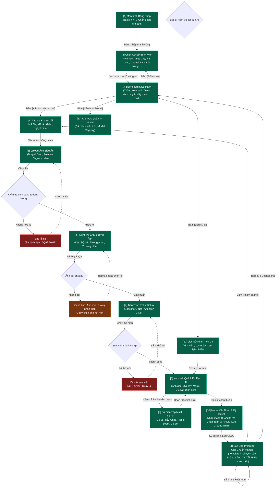

# Ovarian Ultrasound AI Decision Support — User Flow

> **Khóa luận Tốt nghiệp**: *“Xây dựng hệ thống hỗ trợ phân đoạn tổn thương trên ảnh siêu âm buồng trứng ứng dụng Deep Learning theo mô hình Human-in-the-Loop”*  
> **Sinh viên**: Nguyễn Hữu Dũng — MSV: 11235559 — Lớp: HTTTQL 65A, ĐH Kinh tế Quốc dân  
> **Cán bộ hướng dẫn**: ThS. Trần Thanh Hải  
> **Bối cảnh & Dữ liệu lâm sàng**: Bệnh viện Đa khoa Quốc tế Vinmec Times City  
> **Bản chất phần mềm**: Bản mẫu nghiên cứu thực nghiệm (Academic Research Prototype)

## 1. User Flow (Tổng Thể)

## 2. Danh Sách Màn Hình

| [#] | Slug | Màn hình | Mục đích | Thuộc flow |
|-----|------|----------|----------|------------|
| 1 | `login` | Đăng nhập | Xác thực phiên làm việc của Bác sĩ / Nhân viên y tế | `auth-flow` |
| 2 | `facility-select` | Chọn cơ sở làm việc | Lựa chọn Bệnh viện Vinmec (Times City, Hạ Long, Central Park, Đà Nẵng, Hải Phòng, Nha Trang, Phú Quốc) để tự động định danh Header phiếu khám | `auth-flow` |
| 3 | `dashboard` | Tổng quan điều hành | Thống kê nhanh, lối tắt phân tích ca mới và danh sách ca gần đây theo cơ sở đã chọn | `main-dashboard-flow` |
| 4 | `create-case` | Tạo ca khám mới | Nhập mã bệnh nhân, mã lần khám, ngày siêu âm và lý do khám | `analysis-workflow` |
| 5 | `upload-image` | Tải ảnh siêu âm | Kéo thả hoặc chọn file ảnh siêu âm PNG/JPG hoặc chọn ca mẫu | `analysis-workflow` |
| 6 | `quality-check` | Kiểm tra chất lượng (IQA) | Đánh giá độ nét, độ tương phản và trường nhìn siêu âm trước khi chạy AI | `analysis-workflow` |
| 7 | `ai-inference` | Tiến trình phân tích AI | Hiển thị trạng thái suy luận từng bước của mô hình (Baseline U-Net / Attention U-Net) | `analysis-workflow` |
| 8 | `results-view` | Xem kết quả AI | Hiển thị ảnh gốc, overlay vùng u nang và bảng số đo D1, D2, Diện tích | `analysis-workflow` |
| 9 | `mask-editor` | Bộ biên tập Mask (HITL) | Cho phép Bác sĩ dùng cọ/tẩy/undo/redo/zoom để tinh chỉnh ranh giới mask | `analysis-workflow` |
| 10 | `confirm-signoff` | Xác nhận & Ký duyệt | Bác sĩ xác nhận an toàn chuyên môn, ghi chú mô tả Buồng trứng (Phải/Trái/Douglas) và lưu Ground Truth | `analysis-workflow` |
| 11 | `report-complete` | Hoàn tất & Xuất báo cáo | Xem trước & In phiếu kết quả chẩn đoán chuyên biệt buồng trứng (chuẩn A4 Vinmec 1:1), Xuất PDF hoặc khám ca mới | `report-flow` |
| 12 | `case-history` | Lịch sử ca khám | Tìm kiếm, lọc theo ngày/trạng thái và mở lại toàn bộ hồ sơ ca cũ | `history-flow` |
| 13 | `admin-telemetry` | Quản trị kỹ thuật | Theo dõi Model Registry (Standard U-Net Baseline, Attention U-Net), phần cứng và benchmark | `admin-flow` |

## 3. Danh Sách Flow

| Flow-slug | Tên flow | Màn hình gồm | Cases phủ |
|-----------|----------|--------------|-----------|
| `auth-flow` | Luồng xác thực & Chọn cơ sở | `login` → `facility-select` | Đăng nhập tài khoản Bác sĩ, chọn cơ sở bệnh viện công tác |
| `analysis-workflow` | Luồng phân tích ca siêu âm hoàn chỉnh | `create-case` → `upload-image` → `quality-check` → `ai-inference` → `results-view` → `mask-editor` → `confirm-signoff` → `report-complete` | Happy path, Ảnh mờ cảnh báo, File sai định dạng, Chỉnh sửa mask bởi Bác sĩ |
| `main-dashboard-flow` | Luồng tổng quan điều hành | `dashboard` ↔ `case-history`, `dashboard` ↔ `admin-telemetry`, `dashboard` ↔ `facility-select` | Xem thống kê, làm mới danh sách, điều hướng phân tích ca mới, chuyển đổi cơ sở làm việc |
| `history-flow` | Luồng tra cứu & tái mở ca | `case-history` ↔ `results-view` | Tìm kiếm theo PID/Mã ca, Lọc trạng thái, Mở lại chi tiết ca khám, Tải lại PDF |
| `report-flow` | Luồng in ấn & xuất phiếu kết quả | `report-complete` | Kết xuất mẫu phiếu A4 chuyên sâu buồng trứng, cập nhật Header theo cơ sở, xuất PDF / in trực tiếp |
| `admin-flow` | Luồng quản trị mô hình AI | `admin-telemetry` | Giám sát Model Registry, đo độ trễ suy luận, kiểm tra độ chính xác DSC/IoU |

## 3.5. Bảng Chuyển Màn Hình (Screen Transitions)

| Từ màn [#] | Đến màn [#] | Trigger | Điều kiện |
|-----------|------------|---------|-----------|
| `login` [1] | `facility-select` [2] | Bấm `[Đăng nhập]` | Tài khoản y tế hợp lệ |
| `facility-select` [2] | `dashboard` [3] | Bấm `[Xác nhận cơ sở]` | Đã chọn cơ sở Vinmec |
| `dashboard` [3] | `facility-select` [2] | Bấm nút `[Đổi cơ sở]` trên Header | Muốn chuyển cơ sở làm việc |
| `dashboard` [3] | `create-case` [4] | Bấm nút `[+ Phân tích ca mới]` | Luôn luôn |
| `dashboard` [3] | `case-history` [12] | Bấm nút `[Lịch sử ca khám]` | Luôn luôn |
| `dashboard` [3] | `admin-telemetry` [13] | Bấm nút `[Cấu hình Model]` | Quyền quản trị / Bác sĩ |
| `create-case` [4] | `upload-image` [5] | Bấm `[Tiếp tục: Upload ảnh]` | Mã bệnh nhân (PID) đã được nhập hợp lệ |
| `upload-image` [5] | `quality-check` [6] | Bấm `[Kiểm tra chất lượng]` | Đã chọn ít nhất 1 ảnh siêu âm hợp lệ |
| `quality-check` [6] | `ai-inference` [7] | Bấm `[Bắt đầu phân tích AI]` | Ảnh đạt tiêu chuẩn IQA (Điểm ≥ 0.45) |
| `ai-inference` [7] | `results-view` [8] | Tự động chuyển khi AI hoàn tất | Mô hình Attention U-Net trả về kết quả thành công |
| `results-view` [8] | `mask-editor` [9] | Bác sĩ tương tác vẽ/tẩy trên Canvas | Khi chuyển công cụ Cọ vẽ (Brush) hoặc Tẩy (Eraser) |
| `results-view` [8] | `confirm-signoff` [10] | Bấm `[Xác Nhận & Ký Duyệt]` | Đã kiểm tra kết quả |
| `confirm-signoff` [10] | `report-complete` [11] | Bấm `[Xác Nhận & Lưu Ca]` | Lưu CSDL thành công |
| `report-complete` [11] | `create-case` [4] | Bấm `[Phân tích ca mới]` | Bắt đầu chu trình ca mới |
| `report-complete` [11] | (In A4 / PDF) | Bấm `[In / Xuất PDF]` | Mở hộp thoại in trình duyệt chuẩn A4 1:1 |
| `case-history` [12] | `results-view` [8] | Bấm `[Mở ca]` | Mở chi tiết ca đã lưu |

## 4. Đặc tả Template Phiếu Kết Quả Chẩn Đoán (Chuyên Sâu Buồng Trứng)

1. **Header động theo Cơ sở y tế**: Tên bệnh viện, Địa chỉ, Số điện thoại, Hotline cấp cứu tự động lấy theo cơ sở Vinmec đã chọn.
2. **Khu vực Thông tin Bệnh nhân**: PID, Tên bệnh nhân, Giới tính, Ngày sinh, Ngày chỉ định, Loại khám, Bác sĩ chỉ định, Mã RPID.
3. **Kỹ thuật thực hiện**: Siêu âm 2D / Doppler màu kết hợp AI Attention U-Net phân đoạn tổn thương và trích xuất kích thước tự động.
4. **Mô tả chuyên sâu Buồng trứng (Đã loại bỏ các phần thai sản/tử cung thừa)**:
   - **Buồng trứng phải**: Kích thước buồng trứng, vị trí, mô tả u nang/khối tổn thương, đo đạc $D_1, D_2, \text{Diện tích}$, Doppler mạch máu (RI).
   - **Buồng trứng trái**: Kích thước buồng trứng, cấu trúc nhu mô, số lượng nang noãn sinh lý.
   - **Túi cùng Douglas & Tiểu khung**: Đánh giá dịch tự do cùng đồ (phục vụ loại trừ tràn dịch/xuất huyết nang).
5. **Kết luận chẩn đoán**: Phân loại theo thang điểm O-RADS / IOTA và khuyến nghị theo dõi lâm sàng.
6. **Chữ ký Bác sĩ & Footer**: Chức danh, tên Bác sĩ ký duyệt và mã kiểm định hệ thống AI.

