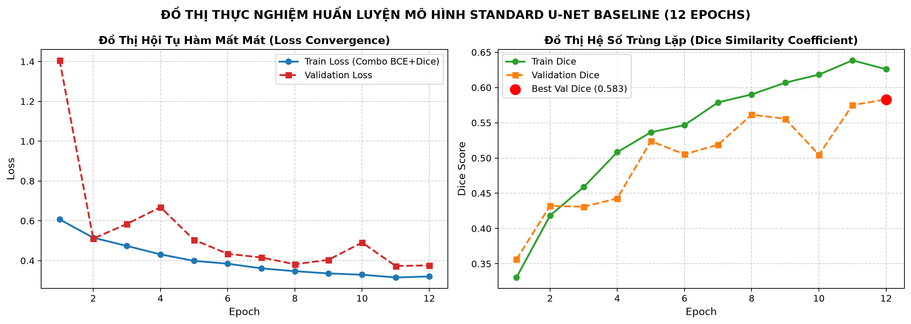
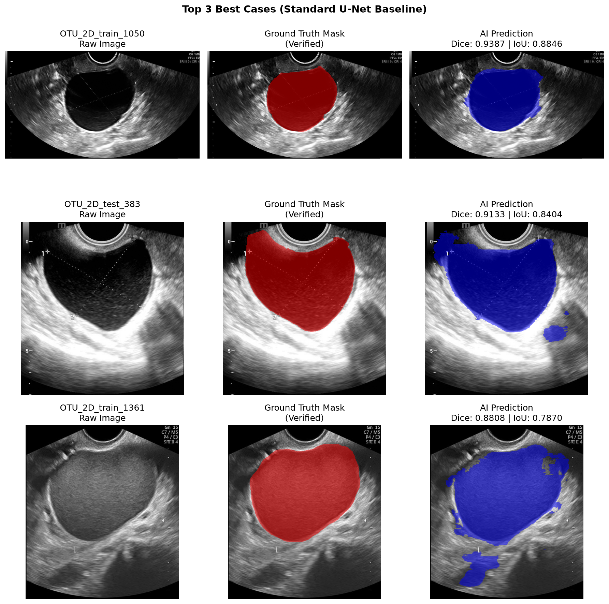

# BÁO CÁO TIẾN ĐỘ KHÓA LUẬN TỐT NGHIỆP — MỐC 2

**Giai đoạn:** 21/09/2026 – 05/10/2026  
**Đề tài:** Xây dựng hệ thống hỗ trợ phân đoạn tổn thương trên ảnh siêu âm buồng trứng ứng dụng Deep Learning theo mô hình Human-in-the-Loop  
**Sinh viên:** Nguyễn Hữu Dũng — **MSV:** 11235559  
**Giảng viên hướng dẫn:** ThS. Trần Thanh Hải

Kính gửi Thầy,

Em xin báo cáo ngắn tiến độ Mốc 2. Bộ dữ liệu, cách chia tập, pipeline và kết quả mô hình cơ sở được kế thừa từ Mốc 1; trong Mốc 2 không chia lại dữ liệu, không huấn luyện lại trên bộ 307 ảnh và không thực hiện phép đánh giá mới trên Test Mốc 1.

## 1. Công việc hoàn thành

| Nhiệm vụ | Kết quả và minh chứng |
| --- | --- |
| Đánh giá U-Net cơ sở | Giữ nguyên Standard U-Net của Mốc 1 và kết quả tham chiếu: Validation Dice 0,5830; Test Foreground Dice 0,5719, IoU 0,4405. Đây là Segmentation Metrics, không phải Diagnostic Accuracy. |
| Khảo sát kiến trúc cải tiến | Chưa triển khai kiến trúc thứ hai trong Mốc 2; ưu tiên hoàn thiện luồng lõi với mô hình hiện có. |
| Web Prototype | Hoàn thiện luồng `Upload → Segmentation → Original/Mask/Overlay → Review/Edit → Confirm/Save` bằng FastAPI/PyTorch và giao diện HTML/Canvas. |
| Human-in-the-Loop | Có Brush, Eraser, điều chỉnh kích thước nét, Undo/Redo và lưu mask sau rà soát. Confirm ghi nhận thao tác review, không tự biến mask thành Ground Truth được chuyên môn xác nhận. |

## 2. Dữ liệu và kết quả mô hình kế thừa từ Mốc 1

Mốc 1 chốt **307 ảnh**, gồm **215 Train / 46 Validation / 46 Test**; báo cáo Mốc 1 ghi nhận 185 mã nhóm ẩn danh và split không trùng mã. Kiểm toán dữ liệu hiện có xác nhận mã nguồn bệnh nhân chưa được đối chiếu với định danh gốc của bệnh viện; vì vậy kết quả được hiểu trong phạm vi phân tầng dữ liệu đã lưu, không khẳng định độc lập theo PID bệnh viện.

Cấu hình được kế thừa nguyên trạng: Standard U-Net 2D (7.762.465 tham số), đầu vào grayscale 512×512 theo Letterbox, Combo Loss (0,5 BCE + 0,5 Soft Dice), AdamW và Cosine Annealing; huấn luyện 12 epoch, chọn checkpoint theo Validation Dice tốt nhất tại epoch 12. Các kết quả sau đây là số liệu Mốc 1, không phải thực nghiệm mới của Mốc 2.

| Tập / chỉ số | Kết quả Mốc 1 |
| --- | ---: |
| Validation Dice | 0,5830 |
| Test Foreground Dice | 0,5719 ± 0,2482 |
| Test IoU | 0,4405 ± 0,2341 |
| Test Recall | 0,6362 |
| Test Precision | 0,5864 |
| Test Specificity — 5 bản ghi mask rỗng theo định nghĩa của Mốc 1 | 0,8235 |

Nguồn: `evaluation/baseline_test_metrics.json`, `checkpoints/archive_milestone_1/README.md` và Báo cáo Mốc 1. Các chỉ số là **Segmentation Metrics** đo độ chồng lấp/phân loại pixel, không đại diện cho độ chính xác chẩn đoán lâm sàng. Các mask rỗng dẫn xuất chưa được xác nhận là nhãn âm tính lâm sàng.

**Hình 1.** Đồ thị Loss và Dice được giữ nguyên từ Báo cáo Mốc 1; không phải kết quả huấn luyện mới ở Mốc 2.

**Hình 2.** Các ví dụ ảnh gốc, mask tham chiếu và prediction được giữ nguyên từ Báo cáo Mốc 1; chỉ minh họa kết quả baseline đã báo cáo, không dùng để suy luận bệnh học.

## 3. Prototype, kiểm thử và giới hạn

Prototype hỗ trợ năm bước khép kín: tải ảnh; chạy phân đoạn; xem Original/Mask/Overlay; rà soát/chỉnh sửa bằng Brush hoặc Eraser; xác nhận và lưu kết quả. Nhật ký Browser Smoke Test ngày 04/10 ghi PASS cho kịch bản một ảnh Validation (`evaluation/milestone_2_m1_scope/browser_smoke_2026-10-04.json`). Bộ kiểm thử tự động ghi nhận **61 passed, 0 failed** (`evaluation/milestone_2_m1_scope/pytest_2026-10-04.txt`).

Phép đo suy diễn kỹ thuật trên 46 ảnh Validation Mốc 1 ghi nhận median forward pass **30,26 ms** và median tiền xử lý cộng forward **46,04 ms** (`evaluation/m1_validation_sanity_check.json`). Đây là đo kiểm tương thích/vận hành; log ghi checkpoint SHA `5e14be…`, khác checkpoint Mốc 1 SHA `44b862…` được lưu tại `checkpoints/archive_milestone_1/`. Do đó phép đo này không chứng minh hiệu năng phân đoạn của checkpoint Mốc 1 và không thay thế các metric trong Mục 2. Browser smoke test cũng là kiểm tra chức năng, không phải đánh giá hiệu năng lâm sàng hoặc usability trên nhiều người dùng.

Rủi ro còn lại: chưa có mapping xác thực từ mã ẩn danh tới PID bệnh viện; nguồn provenance của 35 mask rỗng dẫn xuất cần được xác minh trước khi dùng chúng làm nhãn đánh giá; chưa có so sánh kiến trúc thứ hai hoặc phản hồi usability từ chuyên viên y tế. Mốc 2 không dùng Test Mốc 1 để chọn checkpoint/ngưỡng và không thực hiện đánh giá Test mới.

## 4. Kế hoạch tiếp theo

1. Thống nhất checkpoint tích hợp với checkpoint Mốc 1 trước khi công bố prototype là đang chạy chính mô hình baseline Mốc 1; sau khi thay đổi cần lưu SHA và chạy lại kiểm tra nạp/suy diễn.
2. Giữ nguyên split 215/46/46 và chỉ đánh giá Test theo kế hoạch được Thầy duyệt, với Ground Truth và lịch sử truy cập dữ liệu được xác minh.
3. Lưu ảnh prediction/overlay và log thao tác HITL có nguồn gốc rõ ràng; phân tích ca tốt/lỗi mà không gán nhãn bệnh học ngoài metadata.
4. Nếu tiếp cận được chuyên viên, ghi nhận thời gian thao tác và phản hồi về Brush/Eraser, Undo/Redo, Confirm/Save.

Kính báo cáo Thầy.

**Nguyễn Hữu Dũng**  
MSV: 11235559
