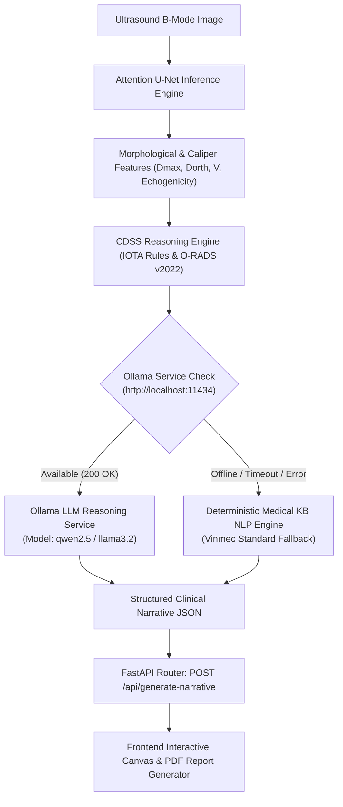

# Design Document: Ollama Hybrid Clinical Reasoning Engine & Fallback Architecture
**Date**: 2026-09-01  
**Project**: Ovarian Ultrasound AI Decision Support System (Human-in-the-Loop)  
**Status**: APPROVED  
**Author**: Antigravity AI & Nguyen Huu Dung (MIS 65A - NEU)  

---

## 1. Executive Summary & Clinical Context
The system currently provides Attention U-Net 512x512 deep learning segmentation and deterministic Medical Knowledge Base (IOTA Simple Rules & ACR O-RADS US v2022) clinical decision support.

This design introduces a **Hybrid Safety Clinical Reasoning Engine** integrating a local Ollama Large/Small Language Model (e.g., `qwen2.5:7b`, `llama3.2`, `gemma2:9b`). The LLM synthesizes computer vision geometric measurements, acoustic profile biomarkers, and evidence-based CDSS classifications into structured, publication-grade Vietnamese sonographic finding descriptions and diagnostic recommendations, backed by a deterministic Rule-Based Medical KB fallback for zero downtime and zero medical error risk.

---

## 2. Architecture & System Boundary



---

## 3. Component Details & Interface Contracts

### 3.1. `backend/services/ollama_service.py` (New Module)
- **Role**: Manages local HTTP communications with Ollama REST API (`http://localhost:11434/api/generate`).
- **Configurable Parameters**:
  - `ollama_host`: `http://localhost:11434`
  - `model_name`: `qwen2.5:7b` (default, customizable via env)
  - `timeout_seconds`: `4.0`
- **Clinical System Prompt**:
  - Instructs the LLM to act strictly as a Senior Gynecologic Radiologist at Vinmec Healthcare System.
  - Mandates output in pure JSON format:
    ```json
    {
      "sonographic_findings_text": "Mô tả siêu âm chi tiết...",
      "clinical_conclusion_text": "Kết luận chẩn đoán & đề xuất lâm sàng..."
    }
    ```
- **Error Handling**: Gracefully handles `httpx.ConnectError`, `httpx.TimeoutException`, and JSON parsing errors, raising a custom `OllamaServiceException` to trigger immediate fallback.

### 3.2. `backend/services/clinical_nlp_service.py` (Upgraded)
- Integrates `OllamaService` alongside `CDSSReasoningEngine`.
- Method `generate_clinical_narrative(vision_findings, patient_info, doctor_pathology, use_ollama=True)`:
  1. Computes CDSS classification (O-RADS category, IOTA B-rules/M-rules, exact dimensions).
  2. If `use_ollama=True`, attempts LLM narrative generation.
  3. On success: Returns narrative with `generation_mode: "Ollama Local LLM (qwen2.5)"`.
  4. On failure/fallback: Reverts seamlessly to deterministic template engine with `generation_mode: "Deterministic Medical KB NLP Engine (Fallback)"`.

### 3.3. FastAPI API Router & Pydantic Schemas
- **Request Schema** (`CDSSEvaluateRequest` / Narrative payload):
  - Added `use_ollama: bool = True`
  - Added `model_name: str | None = None`
- **Response Schema**:
  - `sonographic_findings_text`: `str`
  - `clinical_conclusion_text`: `str`
  - `cdss_summary`: `dict`
  - `generation_mode`: `str`
  - `guideline_provenance`: `list[str]`

---

## 4. Verification & Testing Strategy
- Unit tests in `tests/test_ollama_clinical_reasoning.py`:
  1. **Mocked Ollama Success**: Verifies valid JSON parsing and response structure.
  2. **Mocked Ollama Offline/Timeout**: Verifies seamless fallback to Deterministic Medical KB.
  3. **End-to-End API Test**: Verifies `POST /api/generate-narrative` with `use_ollama` flag.

---

## 5. Implementation Roadmap
1. Create `backend/services/ollama_service.py`
2. Update `backend/services/clinical_nlp_service.py`
3. Update `backend/schemas/schemas.py` and API routers
4. Write and run tests in `tests/test_ollama_clinical_reasoning.py`
