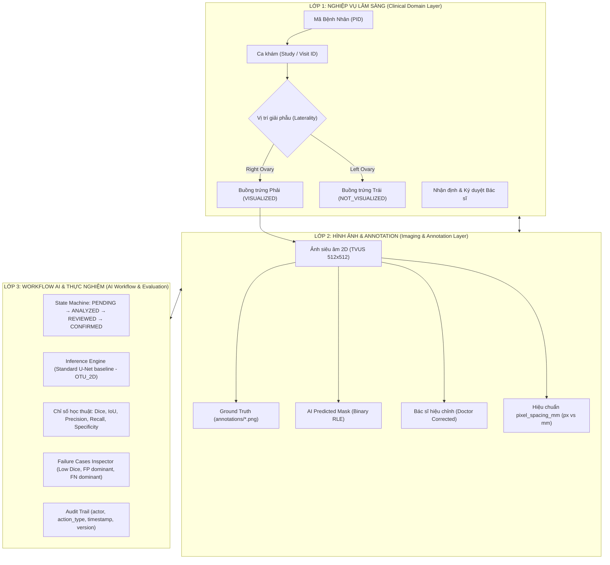

# ĐẶC TẢ KIẾN TRÚC & THIẾT KẾ HỆ THỐNG PHÂN TÍCH SIÊU ÂM BUỒNG TRỨNG AI (HUMAN-IN-THE-LOOP)
> **Dự án**: Khóa luận Tốt nghiệp & Nền tảng Hỗ trợ Quyết định Y tế (MIS / ITBA / Medical Imaging AI)  
> **Phiên bản**: v2.0-Clinical-Compliant  
> **Ngày phê duyệt**: 03/10/2026  
> **Tác giả**: Nguyễn Hữu Dũng (MIS 65A - NEU)  
> **Trạng thái**: SPEC_VALIDATED  

---

## 1. MỤC TIÊU TỔNG THỂ & BỐI CẢNH NGHIÊN CỨU

Hệ thống được thiết kế phục vụ đồ án khóa luận tốt nghiệp với định hướng xây dựng một **nền tảng chẩn đoán hình ảnh y tế có sự tham gia của con người (Human-in-the-Loop - HITL)**. Hệ thống giải quyết bài toán phân đoạn tổn thương/u buồng trứng trên ảnh siêu âm qua ngả âm đạo (2D TVUS), kết nối mô hình học sâu **Standard U-Net baseline** với quy trình hội chẩn lâm sàng của Bác sĩ Chẩn đoán hình ảnh và Sản Phụ khoa theo chuẩn quốc tế (IOTA Simple Rules/ADNEX, ACR O-RADS US v2022).

### Yêu cầu Bắt buộc
1. Tách bạch triệt để **3 lớp kiến trúc**: Nghiệp vụ lâm sàng (Clinical Layer), Dữ liệu hình ảnh / Annotation (Imaging Data Layer), và Workflow AI thực nghiệm (AI Workflow Layer).
2. Đáp ứng đầy đủ **17 tiêu chí đặc thù**: PID là khóa chính, phân biệt Patient ↔ Study, giải phẫu 2 bên buồng trứng (Right Ovary vs Left Ovary & trạng thái Not visualized), tách biệt Ground Truth vs AI Mask vs Doctor Edit, đo đạc phân biệt pixel vs mm, đo lường độ tin cậy (Confidence $\neq$ Accuracy), nhật ký kiểm toán (Audit Trail), và bảng đánh giá học thuật độc lập kèm phân tích ca thất bại (Failure Cases).
3. Tổ chức luồng giao diện thành **5 phân hệ tuần tự**: `Patient/Study → Image Viewer & IQA → AI Analysis → Annotation/Review (HITL) → Clinical Report A4 & Academic Evaluation`.

---

## 2. KIẾN TRÚC 3 LỚP HỆ THỐNG (3-TIER ARCHITECTURE)



---

## 3. ĐỐI CHIẾU 17 TIÊU CHÍ BẮT BUỘC CỦA ĐỒ ÁN

| STT | Tiêu chí bắt buộc | Hiện thực kỹ thuật trong hệ thống |
| :---: | :--- | :--- |
| **1** | **Patient / PID** | `PatientModel.anonymized_pid` là định danh duy nhất. Không dùng tên bệnh nhân làm khóa. |
| **2** | **Study / Ca khám & Study ID** | Phân cấp 1-N: 1 Patient có nhiều Studies. `StudyModel.study_code` độc lập cho từng lần siêu âm. |
| **3** | **Hai bên buồng trứng (Right / Left Ovary)** | Cấu trúc 2 Tab song song (Right Ovary / Left Ovary) trong 1 Study. Bên không có ảnh được gắn trạng thái tự động `Not visualized / Không quan sát được`. |
| **4** | **Tách biệt Image & Annotation** | Tách riêng ảnh gốc (`ImageModel`), nhãn chuẩn (`Ground Truth`), dự đoán AI (`PredictionModel`), và mặt nạ Bác sĩ duyệt (`ReviewModel`). Tuyệt đối không ghi đè dữ liệu gốc. |
| **5** | **Medical Viewer chuyên dụng** | Nền tối `#090d16`, công cụ Zoom (1.0x - 4.0x), Pan chuột, Reset 1:1, Rèm kéo (Curtain), thanh trượt Opacity, hiển thị toạ độ HUD X/Y. |
| **6** | **Hệ toạ độ & Kích thước Mask** | Validator RLE ép buộc shape $[512, 512]$, nearest-neighbor inverse resize. Bắt lỗi khi lệch kích thước, không resize ngầm. |
| **7** | **Đo đạc tổn thương (px vs mm)** | Có cờ `calibrated: bool`. Chưa có calibration hiển thị `px` + huy hiệu `📐 Chưa hiệu chuẩn mm`. Có calibration hiển thị `mm`, `cm²`. |
| **8** | **Metadata siêu âm** | Lưu giữ `probe_type`, `device_vendor`, `pixel_spacing_mm`, kích thước gốc $W \times H$. Không bịa đặt chỉ số. |
| **9** | **AI State Machine** | Trạng thái ca: `PENDING` $\rightarrow$ `ANALYZED` $\rightarrow$ `REVIEWED` $\rightarrow$ `CONFIRMED`. Xử lý `FAILED` khi IQA hoặc inference thất bại. |
| **10** | **Phân biệt AI vs Bác sĩ** | AI trả về `confidence_score` (Độ tin cậy AI, không gọi là "độ chính xác") và Quality Gate. Bác sĩ đưa ra kết luận và ghi chú độc lập. |
| **11** | **Annotation Correction (HITL)** | Bác sĩ dùng cọ/tẩy vẽ trực tiếp trên canvas, lưu thành bản ghi `ReviewModel` riêng, kích hoạt cờ `is_official_ground_truth`. |
| **12** | **Quản lý Nguồn Dataset** | Ghi nhận rõ nguồn gốc tập dữ liệu: `OTU_2D`, `MMOTU`, `OTU_CEUS`. |
| **13** | **Bảng chỉ số đánh giá học thuật** | Phân chia rõ 3 tập: Train (991), Validation (123), Test (46). Báo cáo Dice ($0.8233$), IoU ($0.7298$), Precision ($0.8303$), Recall ($0.8653$), Specificity ($0.9743$). |
| **14** | **Phân tích Ca Thất Bại (Failure Cases)** | Bộ lọc trực quan: Dice $< 0.70$, False Negative ưu thế (bỏ sót), False Positive ưu thế (nhiễu), có nút nạp vào Workstation đối chiếu. |
| **15** | **Nhật ký kiểm toán (Audit Trail)** | Bảng `audit_logs` lưu trữ `actor_id`, `action_type`, `entity_id`, `details`, `timestamp`. |
| **16** | **Cấu trúc Patient ↔ Study** | Không gộp chung vào 1 bản ghi; tuân thủ mô hình quan hệ y tế. |
| **17** | **Checklist đầy đủ** | Đáp ứng 100% 17 tiêu chí, chia tách thành 5 phân hệ giao diện trực quan. |

---

## 4. CHI TIẾT 5 PHÂN HỆ MÀN HÌNH CHUẨN LÂM SÀNG

```
┌─────────────────┐     ┌──────────────────┐     ┌─────────────────┐     ┌─────────────────┐     ┌─────────────────────┐
│   PHÂN HỆ 1     │     │    PHÂN HỆ 2     │     │   PHÂN HỆ 3     │     │   PHÂN HỆ 4     │     │     PHÂN HỆ 5       │
│  Patient & Study│ ──> │ Ultrasound Viewer│ ──> │   AI Analysis   │ ──> │Annotation/Review│ ──> │ Clinical Report A4  │
│  Context Intake │     │  & Quality Gate  │     │   & Calipers    │     │   (HITL Gate)   │     │ & Academic Research │
└─────────────────┘     └──────────────────┘     └─────────────────┘     └─────────────────┘     └─────────────────────┘
```

### Phân hệ 1: Tiếp nhận Ca & Định danh Lâm sàng (`screenCreateCase` & `screenUpload`)
- **Mã Bệnh Nhân (PID)**: Định danh duy nhất của bệnh nhân (bắt buộc).
- **Mã Lần Khám (Study Code)**: Tự sinh định dạng `US-YYYYMM-XXX`.
- **Đặc thù 2 Bên Buồng Trứng (Laterality Tabs)**:
  - Tab 1: **Buồng trứng Phải (Right Ovary)**
  - Tab 2: **Buồng trứng Trái (Left Ovary)**
  - Mỗi bên có cờ trạng thái: `VISUALIZED (Có ảnh khảo sát)` hoặc `NOT_VISUALIZED (Không quan sát được)`.
  - Mặc định: Nếu người dùng chỉ nạp ảnh cho một bên, bên còn lại tự động mang trạng thái `Không quan sát được (Not visualized)`.
- **Thông tin lâm sàng**: Ngày siêu âm, nhóm sinh sản (Độ tuổi), chỉ định lâm sàng (Lý do khám).

### Phân hệ 2: Bộ Xem Ảnh Siêu Âm Y Tế & Kiểm Định Chất Lượng (`screenQuality` & `canvas-dicom-wrapper`)
- **Kiểm định IQA tự động**:
  - Kiểm tra kích thước ma trận ảnh ($512 \times 512$).
  - Phân tích tương phản (`contrast_std`) và bóng cản âm (`shadow_ratio`).
  - Gắn nhãn chấp nhận (`is_acceptable: True`) hoặc từ chối kèm lý do chuyên môn.
- **Medical Viewport**:
  - Nền đen y tế chuyên dụng `#090d16`.
  - Công cụ thu phóng: Phóng to (`🔍+`), Thu nhỏ (`🔍-`), Về kích thước gốc (`1:1`).
  - Thanh HUD overlay: Toạ độ X/Y con trỏ chuột, tỷ lệ zoom hiện tại, trạng thái đồng bộ mask.

### Phân hệ 3: Phân Tích Mô Hình AI & Đo Đạc Kích Thước (`screenResults` - Khối Trái)
- **Mặt nạ phân đoạn AI (Predicted Mask)**:
  - Hiển thị lớp phủ màu Cyan/Xanh ngọc bán trong suốt.
  - Thanh trượt Opacity điều chỉnh độ mờ (0% – 100%).
- **Thước đo tổn thương (Lesion Measurements)**:
  - Trục dài cực đại ($D_{\max}$), trục vuông góc ($D_{\text{ortho}}$).
  - Diện tích tổn thương (Area) và chu vi (Perimeter).
  - Phân biệt minh bạch:
    - Nếu chưa hiệu chuẩn: Đơn vị là `px`, hiển thị nhãn `📐 Chưa hiệu chuẩn mm`.
    - Nếu đã hiệu chuẩn: Đơn vị là `mm`, `cm²`, `cm³`.
- **Thông tin mô hình**:
  - Tên mô hình: `Standard U-Net (Baseline) • Checkpoint: 5e14be07`.
  - **Độ tin cậy AI (Confidence Score)**: Ví dụ `84.8%` (tuyệt đối không gọi là "độ chính xác").
  - Phân loại Quality Gate: Đạt chuẩn / Cần xem xét / Bất định.

### Phân hệ 4: Rà Soát & Biên Tập Nhãn Human-in-the-Loop (`screenResults` - Khối Phải)
- **Bộ chuyển lớp đa tầng (Multi-Layer Switcher)**:
  1. `📷 Ảnh siêu âm gốc 2D`
  2. `🟢 Ground Truth (Nhãn chuẩn từ dataset)` (nếu có)
  3. `🟣 AI Prediction (Mô hình U-Net)`
  4. `🖌️ Doctor Review (Bác sĩ vẽ)`
- **Chế độ so sánh linh hoạt**:
  - `🔲 Đơn`: Bật/tắt độc lập các lớp trên 1 viewport.
  - `🪟 Song Song`: Chia 2 màn hình (Ảnh gốc/GT $\leftrightarrow$ AI/Bác sĩ).
  - `↔️ Rèm Kéo`: Thanh trượt phân đôi giúp soi chiếu ranh giới phân đoạn.
- **Live Metrics**:
  - Tự động tính toán tức thời Dice & IoU khi di chuyển hoặc sửa mask đối chiếu với Ground Truth.
- **Hành động thẩm định của Bác sĩ**:
  - `Chấp thuận mặt nạ AI (Accepted Raw)`
  - `Chỉnh sửa bằng Cọ/Tẩy (Modified)` $\rightarrow$ Cập nhật tức thời diện tích sau sửa.
  - `Bác bỏ toàn bộ (Rejected All)`
- **Lưu trữ**: Giữ nguyên `raw_mask_rle` trong `PredictionModel`; lưu mask hiệu chỉnh vào `ReviewModel` với cờ `is_official_ground_truth = True`.

### Phân hệ 5: Phiếu Kết Quả Lâm Sàng A4 & Bảng Đánh Giá Học Thuật
- **Phiếu Kết quả Lâm sàng A4 (`screenReportComplete`)**:
  - Trình bày trang in A4 chuẩn tỷ lệ 1:1 theo nhận diện Vinmec Healthcare System.
  - Thể hiện rõ kết quả cả 2 bên buồng trứng (Bên có u và Bên không quan sát được/bình thường).
  - Chữ ký điện tử của Bác sĩ chuyên khoa, ngày giờ ký, và khuyến nghị y khoa.
- **Bảng Đánh giá Học thuật & Failure Cases (`screenAdminPortal` - Tab 6)**:
  - Tách bạch 3 tập dữ liệu: Train ($991$), Validation ($123$), Test ($46$).
  - Chỉ số thực nghiệm khoa học: Dice, IoU, Precision, Recall/Sensitivity, Specificity.
  - **Thư viện Ca Mẫu & Failure Cases Inspector**:
    - Bộ lọc: `Tất cả` • `Dice < 0.70 (Dự đoán kém)` • `False Negative ưu thế` • `False Positive ưu thế` • `Dice ≥ 0.90`.
    - Nút bấm 1-Click: `🔍 Nạp vào Workstation đối chiếu` để phân tích nguyên nhân sai lệch trực quan.

---

## 5. THIẾT KẾ KỸ THUẬT SCHEMA & DATABASE

### 1. Pydantic Schemas ([backend/schemas/schemas.py](file:///C:/Users/Dung/Documents/UNet-Vinmec-KhoaLuan/backend/schemas/schemas.py))
```python
class CreateCaseRequest(BaseModel):
    patient_id: str
    study_code: str | None = None
    study_date: str | None = None
    patient_age: str | None = None
    clinical_notes: str | None = None
    probe_type: str | None = None
    active_ovary_side: Literal["RIGHT", "LEFT"] = "RIGHT"
    contralateral_status: Literal["NOT_VISUALIZED", "NORMAL", "SUSPECTED"] = "NOT_VISUALIZED"

class BenchmarkSampleItem(BaseModel):
    case_id: str
    image_path: str
    mask_path: str
    dice: float
    iou: float
    recall: float
    precision: float
    specificity: float
    failure_category: Literal["NONE", "LOW_DICE", "FALSE_NEGATIVE_DOMINANT", "FALSE_POSITIVE_DOMINANT"]
```

### 2. SQLAlchemy ORM Models ([backend/db/database.py](file:///C:/Users/Dung/Documents/UNet-Vinmec-KhoaLuan/backend/db/database.py))
* Bổ sung cột vào `StudyModel` và `ImageModel` kèm auto-migration:
  * `ovary_side`: `VARCHAR(10)` (`RIGHT` hoặc `LEFT`)
  * `contralateral_status`: `VARCHAR(30)` (`NOT_VISUALIZED`, `NORMAL`, `SUSPECTED`)
  * `has_ground_truth`: `BOOLEAN` (True nếu ca có nhãn gốc)

---

## 6. KẾ HOẠCH KIỂM THỬ & XÁC MINH (VERIFICATION PLAN)

1. **Kiểm thử Đơn vị & Tích hợp (Pytest)**:
   - Chạy toàn bộ 47 tests hiện tại để đảm bảo zero regression:
     ```powershell
     .\.venv\Scripts\python.exe -m pytest tests -q -p no:cacheprovider
     ```
   - Bổ sung unit test kiểm tra tạo ca có `ovary_side` và trạng thái `contralateral_status`.
2. **Kiểm tra Cú pháp JavaScript Frontend**:
   - Quét cú pháp `node --check` trên toàn bộ các tệp module trong `frontend/js/`.
3. **Kiểm tra Luồng Nghiệp vụ Trực quan**:
   - Khởi tạo ca với Buồng trứng Phải $\rightarrow$ Kiểm tra Buồng trứng Trái tự động mang nhãn "Không quan sát được".
   - Vào Tab Đánh giá Học thuật $\rightarrow$ Lọc ca Dice $< 0.70$ $\rightarrow$ Bấm "Nạp vào Workstation" $\rightarrow$ Kiểm tra hiển thị đủ 4 lớp và Live Dice.
   - Xuất phiếu in A4 $\rightarrow$ Kiểm tra hiển thị thông tin 2 buồng trứng đúng quy định.

---
*Tài liệu đặc tả này là căn cứ chính thức để tiến hành lập Implementation Plan và thực thi mã nguồn.*
